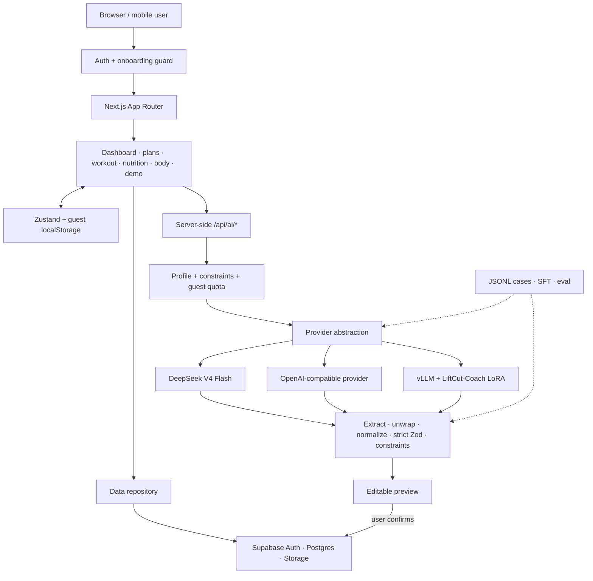

# LiftCut Tracker

<p align="center">
  <a href="https://www.liftcuttracker.com/">
    
  </a>
</p>

<p align="center">
  <strong>从第一次安全训练，到每天看得见的进步。</strong><br />
  An open-source fitness tracker and structured AI planning research project by <a href="https://townzc.github.io/">Zhice Tang</a>.
</p>

<p align="center">
  <strong><a href="https://www.liftcuttracker.com/">🌐 Official website · www.liftcuttracker.com</a></strong>
  ·
  <strong><a href="https://www.liftcuttracker.com/demo">🏋️ No-sign-in beginner demo</a></strong>
  ·
  <a href="docs/LiftCut-Coach-Technical-Report.md">📄 Technical report</a>
  ·
  <a href="https://townzc.github.io/">👤 Author</a>
</p>

<p align="center">
  <a href="https://github.com/Townzc/liftcut-tracker/actions/workflows/ci.yml"></a>
  <a href="https://www.liftcuttracker.com/"></a>
  <a href="LICENSE"></a>
  
  
</p>

LiftCut brings workout completion, exercise performance, food logs, body trends, and AI-generated plans into one bilingual product. Its AI layer treats model output as untrusted structured data: every plan is extracted, normalized, strictly validated, shown in an editable preview, and saved only after user confirmation.

## Project at a glance

| Product | AI system | Research result | Delivery |
| --- | --- | --- | --- |
| Training, nutrition, body trends, onboarding, guest mode, and PDF export | DeepSeek, OpenAI-compatible APIs, or local vLLM behind one provider layer | LiftCut-Coach LoRA: **100% final schema pass** and **99.66% constraint pass** on 293 held-out cases | Deployed Next.js app with Supabase Auth, Postgres, Storage, and RLS |

> **Try it first:** the [public beginner demo](https://www.liftcuttracker.com/demo) works without an account or AI key.

## Why LiftCut?

| Start safely | Build sustainable habits | See the trend | Get reliable AI output |
| --- | --- | --- | --- |
| Bilingual movement demo, easier variations, coaching cues, and conservative starting doses. | Editable plans and daily logs instead of a rigid one-size-fits-all program. | Training, nutrition, and body data stay connected rather than scattered across apps. | Model output is extracted, normalized, strictly validated, previewed, and only saved after confirmation. |

### What is implemented

- public bilingual `/demo` with body-area filters, six starter movements, regressions, cues, and safety boundaries;
- account onboarding plus a local-first guest mode that can later migrate data to Supabase;
- editable training plans, text import, workout logging, personal records, and PDF export;
- food logging, nutrition summaries, body measurements, and trend charts;
- server-side AI training and nutrition generation with structured preview/edit/confirm-save flow;
- DeepSeek, generic OpenAI-compatible, and local vLLM provider modes;
- versioned prompts, Zod schemas, generation history, evaluation scripts, and local LoRA research assets.

The demo adapts a small MIT-licensed **text** subset from [`hasaneyldrm/exercises-dataset`](https://github.com/hasaneyldrm/exercises-dataset). LiftCut's hero artwork is original; the reference repository's separately licensed images and videos are not copied. See [third-party notices](THIRD_PARTY_NOTICES.md).

## Structured-output research

The repository includes a reproducible LiftCut-Coach research pipeline for dataset validation, train/validation/test splitting, SFT conversion, provider evaluation, and local LoRA serving.

| Model | JSON Parse | Final Schema | Constraint Pass | Avg Latency | P50 | P95 |
| --- | ---: | ---: | ---: | ---: | ---: | ---: |
| DeepSeek v4 Pro | 99.66% | 97.95% | 97.95% | 147.7s | 133.6s | 277.4s |
| MiMo v2.5 Pro | 99.32% | 98.29% | 97.27% | 38.7s | 35.3s | 65.6s |
| **LiftCut-Coach LoRA** | **100.00%** | **100.00%** | **99.66%** | **36.8s** | **33.0s** | **63.3s** |

These historical reported results cover 293 held-out evaluation cases and should be read as a structured-output engineering benchmark, not as evidence of clinical effectiveness. The complete original evaluation artifacts are not checked in and have not been reproduced by the new AgentLab work. See the [technical report](docs/LiftCut-Coach-Technical-Report.md) and [measurement audit](docs/research/2026-09-28-evaluation-audit.md) for definitions, evidence gaps, and follow-up checks.

## System architecture



## AI reliability pipeline

Every generated plan follows the same deterministic boundary:

```text
strict prompt + schema example
→ provider JSON mode
→ first-complete-object extraction
→ wrapper-key unwrapping
→ enum and field normalization
→ strict final Zod validation
→ business-constraint checks
→ editable preview
→ user-confirmed save
```

DeepSeek V4 requests explicitly use non-thinking mode for bounded structured generation, a provider-specific timeout, no hidden SDK retry loop, and a maximum output-token limit. API keys remain server-only and error details redact the active key.

## Agent research: evaluation before training

LiftCut-AgentLab studies tool use and post-training for plan adjustments under changing constraints. The dependency-free Python lab now includes **30 proposal development cases and 14 interactive development scenarios**, eight typed tools, versioned user confirmation, temporal preferences, controlled timeouts, and executable trace replay. It runs without GPU or API access.

```bash
python research/liftcut-agent/run.py validate
python research/liftcut-agent/run.py baseline
python research/liftcut-agent/interact.py run
python research/liftcut-agent/interact.py replay --traces research/liftcut-agent/reports/interactive-fixed-traces-2026-09-28.jsonl
python -m unittest discover -s research/liftcut-agent/tests -v
```

The fixed workflow completes 14/14 interactive seeds; ignoring memory completes 12/14 and disabling retries completes 11/14. These are scripted development checks of the environment, **not LLM, training, or generalization results**. The fixtures use artificial exercise blocks and time costs. See the [experiment record](docs/research/2026-09-28-interactive-environment.md).

The first full hosted reference (`deepseek-flash`, non-thinking) passed **8/14 public development tasks** in 70 calls: five single-call protocol mismatches and one terminal-label failure were retained. All trajectories replay offline. The conservative cost estimate is $0.0433947; this is not a reconciled bill or training gain. See the [baseline, failure analysis and cost audit](docs/research/2026-09-28-development-baseline.md).

The next protocol version supports bounded read-only batches and a separately tested pending-approval instruction. Its four-arm live comparison is still pending; 8/14 remains the measured live result. Data preparation now exports **59 verified development decisions** and validates **2,766 assistant target tokens** with a pinned Qwen3-4B tokenizer on CPU. No model weights or training are involved. See the [protocol and data pipeline](docs/research/2026-09-28-protocol-and-data-pipeline.md).

| Phase | Deliverable | Write access |
| --- | --- | --- |
| P0 · implemented | Offline development fixtures, strict proposal scoring, evaluation audit | None |
| P1 · hosted development baseline recorded | Tools, replay, memory, recovery; 8/14 hosted reference, auditable failures and spending; trainable-model comparison pending | Simulated confirmation boundary |
| P2 · data preparation implemented; training pending | Verified dev decision export, tokenizer/loss-mask audit; grouped dataset and Base/SFT still pending | Offline research |
| P3 · planned | Matched-token ablation, research report and minimal demonstration | Offline research |
| P4–P5 · planned | Preference optimization; one online RL or visual-understanding extension | Product writes require confirmed proposals |

Read the [research quickstart](research/liftcut-agent/README.md), [technical roadmap](docs/AGENT_RESEARCH_ROADMAP.md), and [current progress](docs/AGENT_RESEARCH_PROGRESS.md). The earlier [AI Coach blueprint](docs/AI_COACH_AGENT.md) remains a product integration reference; the research roadmap defines implementation order.

The [model-policy adapter](docs/research/2026-09-28-model-policy.md) adds strict native
function calling, request/token/cost reservation limits, raw response and usage
records, and offline response replay. Its credential-free mock verifies the
protocol; it is not a live-model or training benchmark.
An initial `deepseek-flash` pilot passed one development scenario in 8 requests;
its complete response records replay offline. Broader model comparisons remain
pending; see the adapter report for cost and limitations.

## Pages and routes

| Route | Purpose |
| --- | --- |
| `/` | Daily dashboard and trends |
| `/demo` | Public beginner movement explorer |
| `/plan` | Training plan management and PDF export |
| `/plan/ai` | AI plan generation, structured preview, edit, and save |
| `/workout` | Workout execution and history |
| `/nutrition` | Food logging and daily nutrition summary |
| `/body` | Weight and waist trends |
| `/settings` | Profile, goals, preferences, language, and data controls |
| `/onboarding` | First-run profile setup |

## Tech stack

**Product:** Next.js 16 App Router, TypeScript strict, Tailwind CSS, shadcn/ui, Zustand, next-intl, Recharts, jsPDF

**Backend:** Next.js server routes, Supabase Auth, Postgres, Storage, Row Level Security, Zod

**AI and research:** OpenAI-compatible SDK, DeepSeek V4, vLLM, Qwen2.5-14B-Instruct, LoRA, LLaMA-Factory, JSONL evaluation tooling

## Quick start

```bash
git clone https://github.com/Townzc/liftcut-tracker.git
cd liftcut-tracker
npm install
copy .env.example .env.local
npm run dev
```

Open `http://localhost:3000`. The public demo and most guest tracking flows can be explored without an AI key.

### Minimum environment

```env
NEXT_PUBLIC_SUPABASE_URL=your_supabase_project_url
NEXT_PUBLIC_SUPABASE_ANON_KEY=your_publishable_or_anon_key

AI_PROVIDER=deepseek
DEEPSEEK_API_KEY=your_server_only_key
DEEPSEEK_BASE_URL=https://api.deepseek.com/v1
DEEPSEEK_MODEL=deepseek-v4-flash
DEEPSEEK_REQUEST_TIMEOUT_MS=45000
```

Provider modes:

| `AI_PROVIDER` | Use case | Main variables |
| --- | --- | --- |
| `deepseek` | hosted production model | `DEEPSEEK_API_KEY`, `DEEPSEEK_MODEL`, `DEEPSEEK_REQUEST_TIMEOUT_MS` |
| `local` | research/demo with vLLM | `LOCAL_AI_BASE_URL`, `LOCAL_AI_MODEL`, `LOCAL_AI_REQUEST_TIMEOUT_MS` |
| `openai_compatible` | another compatible service | `AI_BASE_URL`, `AI_API_KEY`, `AI_MODEL`, `AI_REQUEST_TIMEOUT_MS` |

Never put a real AI key in a `NEXT_PUBLIC_` variable, browser code, logs, fixtures, commits, or screenshots.

## Research workflow

```bash
# Validate examples or generated data against the production schemas
npm run research:validate -- research/liftcut-coach/data/examples/training_plan_sample.jsonl

# Build SFT data and deterministic splits
npm run research:build-sft -- output.jsonl input.jsonl
npm run research:split -- input.jsonl output_dir 0.8 0.1 0.1

# Generate cases and evaluate the selected provider
npm run research:generate -- cases.jsonl output.jsonl
npm run research:split-convert -- test.jsonl eval_cases.jsonl
npm run research:eval -- eval_cases.jsonl output_prefix
```

Full instructions: [`research/liftcut-coach/README.md`](research/liftcut-coach/README.md).

## Quality checks

```bash
npm test
npm run lint
npm run build
```

The CI workflow runs against `main` and `aliyun`. AI plans are validated before persistence; guest AI usage is quota-limited; Supabase tables use ownership-based RLS policies.

Health content is general educational information. LiftCut does not diagnose injuries or medical conditions and does not replace a doctor, registered dietitian, physical therapist, or qualified coach.

## Documentation

- [AI Coach Agent blueprint](docs/AI_COACH_AGENT.md)
- [LiftCut-Coach technical report](docs/LiftCut-Coach-Technical-Report.md)
- [Project structure](docs/Project-Structure.md)
- [Interview Q&A](docs/Interview-QA.md)
- [Server runbook example](docs/server-runbook.example.md)
- [Contributing](CONTRIBUTING.md)
- [Security policy](SECURITY.md)
- [Third-party notices](THIRD_PARTY_NOTICES.md)

## Maintainer

LiftCut is designed, implemented, and maintained by [Zhice Tang](https://townzc.github.io/), an undergraduate AI researcher at Chongqing University and a Fall 2026 exchange student at UC Berkeley. Research and engineering details are available in the [technical report](docs/LiftCut-Coach-Technical-Report.md); project questions and focused contributions are welcome through GitHub Issues.

## Contributing and license

Issues and focused pull requests are welcome. Good first contributions include demo accessibility, exercise-data review, AI safety fixtures, schema regression cases, translations, and smaller local-model experiments.

LiftCut Tracker is released under the [MIT License](LICENSE).
