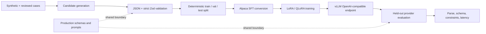

# LiftCut Coach Research

> LiftCut Tracker 的结构化健身计划生成、数据构建、模型评测与本地 LoRA 实验分支。

- **产品网站：** [www.liftcuttracker.com](https://www.liftcuttracker.com/)
- **稳定产品代码：** [`main`](https://github.com/Townzc/liftcut-tracker/tree/main)
- **技术报告：** [LiftCut-Coach Technical Report](docs/LiftCut-Coach-Technical-Report.md)

本分支研究一个明确的问题：如何让语言模型稳定生成符合生产 Schema、满足用户约束、可以被应用安全预览和保存的训练与饮食计划。它不是医疗有效性研究，也不试图让小模型在通用能力上超过大型托管模型。

## Research snapshot

| Model | JSON Parse | Final Schema | Constraint Pass | Avg Latency | P50 | P95 |
| --- | ---: | ---: | ---: | ---: | ---: | ---: |
| DeepSeek v4 Pro | 99.66% | 97.95% | 97.95% | 147.7s | 133.6s | 277.4s |
| MiMo v2.5 Pro | 99.32% | 98.29% | 97.27% | 38.7s | 35.3s | 65.6s |
| **LiftCut-Coach LoRA** | **100.00%** | **100.00%** | **99.66%** | **36.8s** | **33.0s** | **63.3s** |

以上结果来自 293 个留出评测用例，仅用于衡量结构化输出工程表现。数据构造方式、评测边界和局限性见[技术报告](docs/LiftCut-Coach-Technical-Report.md)。

## Research questions

- 模型能否持续输出可解析、可通过严格 Zod Schema 的 JSON？
- 训练天数、器械、时长、伤病提示、饮食偏好等约束能否被可靠遵守？
- 经过 LoRA/QLoRA 微调的小模型，能否在固定任务上获得更低延迟和更稳定的格式？
- 生产环境如何在模型输出与用户数据写入之间建立确定性的安全边界？
- 后续 AI Coach 如何使用训练、饮食和身体趋势，同时保持记忆可解释、可撤销、由用户确认？

## Pipeline



## Repository map

```text
research/liftcut-coach/
  data/       local examples, generated cases and deterministic splits
  prompts/    dataset, training-plan and nutrition-plan prompts
  scripts/    validation, generation, conversion and evaluation tools
  train/      LLaMA-Factory and vLLM configuration examples
```

The Next.js application remains in this branch because the experiments deliberately reuse the same prompts, provider abstraction and validation schemas as the product. Large datasets, model weights, adapters and checkpoints must not be committed.

## Quick reproduction

```bash
npm install

# Validate JSONL against the production schemas
npm run research:validate -- research/liftcut-coach/data/examples/training_plan_sample.jsonl

# Build SFT data and deterministic splits
npm run research:build-sft -- output.jsonl input.jsonl
npm run research:split -- input.jsonl output_dir 0.8 0.1 0.1

# Generate and evaluate cases with the selected provider
npm run research:generate -- cases.jsonl generated.jsonl
npm run research:split-convert -- test.jsonl eval_cases.jsonl
npm run research:eval -- eval_cases.jsonl output_prefix
```

Detailed instructions are in [`research/liftcut-coach/README.md`](research/liftcut-coach/README.md).

## Provider configuration

```env
# Hosted baseline
AI_PROVIDER=deepseek
DEEPSEEK_API_KEY=your_server_only_key
DEEPSEEK_MODEL=deepseek-v4-flash
DEEPSEEK_REQUEST_TIMEOUT_MS=120000

# Or a local vLLM endpoint
AI_PROVIDER=local
LOCAL_AI_BASE_URL=http://127.0.0.1:8000/v1
LOCAL_AI_API_KEY=EMPTY
LOCAL_AI_MODEL=liftcut-coach
LOCAL_AI_REQUEST_TIMEOUT_MS=120000
```

Never commit real API keys, user health records, model weights, LoRA outputs or checkpoints.

## Safety and reproducibility

- Use synthetic or properly licensed/de-identified inputs; do not train on private user records.
- Keep held-out evaluation cases out of training and prompt tuning.
- Record model, prompt version, seed, dataset revision and environment with every comparison.
- Treat all generated plans as general educational information, not diagnosis or individualized medical care.
- Validate output before persistence and require user confirmation before any agent changes a plan or memory.

## Branch policy

- `main`: stable product, deployment, user-facing documentation and production fixes.
- `research`: datasets, evaluation harnesses, model experiments and research reporting, regularly synchronized from `main`.
- Short-lived work branches target either `main` or `research` through a pull request and are deleted after merge.

## Documentation

- [Research pipeline details](research/liftcut-coach/README.md)
- [Technical report](docs/LiftCut-Coach-Technical-Report.md)
- [AI Coach Agent blueprint](docs/AI_COACH_AGENT.md)
- [Project structure](docs/Project-Structure.md)
- [Interview Q&A](docs/Interview-QA.md)
- [Security policy](SECURITY.md)

Released under the [MIT License](LICENSE).
