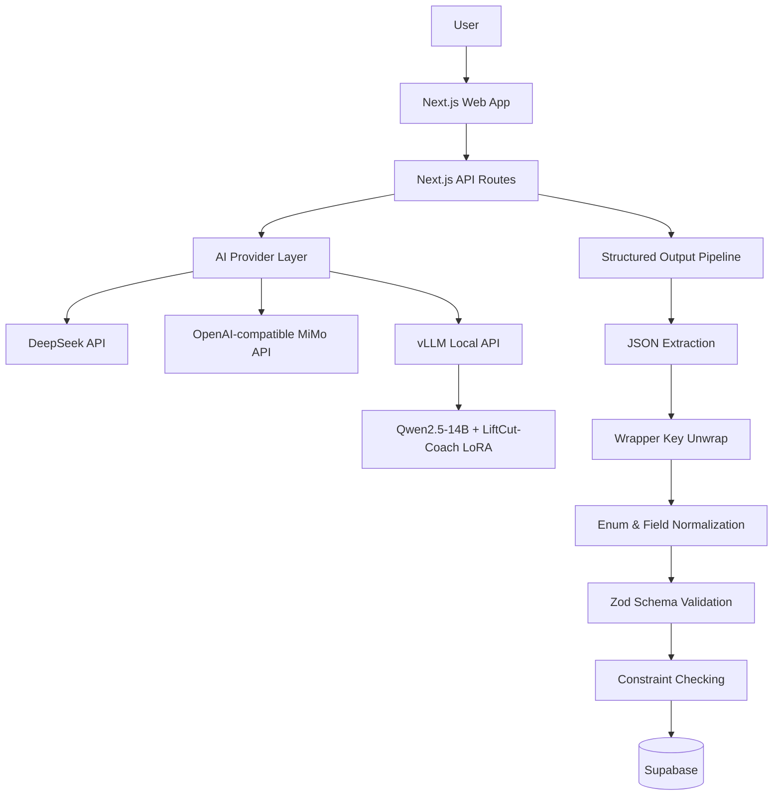

# LiftCut Tracker

AI-powered fitness and fat-loss tracking platform with structured AI plan generation, provider abstraction, and a local LoRA-based LiftCut-Coach backend.

## Highlights

- Full-stack fitness and nutrition tracking web app (Next.js + Supabase)
- AI-generated training and nutrition plans with structured preview, edit, and confirm-save flow
- Strict Zod schema validation for reliable structured output from LLMs
- Multi-provider AI backend: DeepSeek, OpenAI-compatible, local vLLM
- LiftCut-Coach LoRA fine-tuned on Qwen2.5-14B-Instruct — **100% Final Schema Pass** on 293 held-out eval cases
- Research evaluation pipeline measuring schema pass rate, constraint satisfaction, and latency
- vLLM OpenAI-compatible local model serving

## Evaluation Results

| Model | JSON Parse | Final Schema | Constraint Pass | Avg Latency | P50 | P95 |
|---|---:|---:|---:|---:|---:|---:|
| DeepSeek v4 Pro | 99.66% | 97.95% | 97.95% | 147.7s | 133.6s | 277.4s |
| MiMo v2.5 Pro | 99.32% | 98.29% | 97.27% | 38.7s | 35.3s | 65.6s |
| **LiftCut-Coach LoRA** | **100.00%** | **100.00%** | **99.66%** | **36.8s** | **33.0s** | **63.3s** |

> In 293 held-out evaluation cases, LiftCut-Coach LoRA achieved 100% Final Zod Schema Pass and 99.66% Constraint Pass, with zero wrapper-key and enum errors. Compared with DeepSeek v4 Pro and MiMo v2.5 Pro, the LoRA model showed the strongest structured-output stability while maintaining latency close to MiMo.

## Tech Stack

**Frontend:** Next.js App Router, TypeScript, Tailwind CSS, shadcn/ui, Zustand, next-intl, Recharts

**Backend:** Next.js API routes, Supabase Auth, Supabase Postgres, Supabase Storage, Zod

**AI:** DeepSeek API, MiMo / OpenAI-compatible API, Qwen2.5-14B-Instruct, LoRA, vLLM, LLaMA-Factory

## System Architecture



## AI Structured Output Pipeline

Every AI-generated plan goes through a multi-stage pipeline to ensure reliability:

```
Prompt construction (strict schema instructions)
→ Model generation (JSON mode)
→ JSON extraction (trim code fences, find first complete JSON object)
→ Wrapper unwrapping (handle nutrition_plan / meal_plan / data wrappers)
→ Normalization (Chinese meal_type → English enum, goal_type cleanup)
→ Final Zod schema validation (strict, not relaxed)
→ Constraint satisfaction checking (training days, duration, macros)
→ Save / return to frontend
```

## Pages & Routes

| Route | Description |
|---|---|
| `/` | Dashboard |
| `/plan` | Training plan management |
| `/plan/ai` | AI plan generation, preview, edit, save |
| `/workout` | Workout tracking |
| `/nutrition` | Nutrition tracking |
| `/body` | Body metrics |
| `/settings` | User profile, goals, language |
| `/login` `/register` | Auth |

Route guards: unauthenticated users are redirected to `/login`; users with incomplete profiles go to `/onboarding`. Guest mode allows access without an account.

## AI Provider Configuration

`AI_PROVIDER` supports three modes:

| Mode | Description | Key Env Vars |
|---|---|---|
| `deepseek` | Default for production | `DEEPSEEK_API_KEY`, `DEEPSEEK_BASE_URL`, `DEEPSEEK_MODEL` |
| `local` | For research / demo with vLLM | `LOCAL_AI_BASE_URL`, `LOCAL_AI_API_KEY`, `LOCAL_AI_MODEL` |
| `openai_compatible` | Generic OpenAI-compatible service | `AI_BASE_URL`, `AI_API_KEY`, `AI_MODEL` |

### Provider-Specific Timeout

Each provider has a configurable request timeout (in ms), with sensible defaults:

| Provider | Default Timeout | Env Override |
|---|---:|---|
| `deepseek` | 30,000ms | `DEEPSEEK_REQUEST_TIMEOUT_MS` |
| `local` | 120,000ms | `LOCAL_AI_REQUEST_TIMEOUT_MS` |
| `openai_compatible` | 30,000ms | `AI_REQUEST_TIMEOUT_MS` |

Generic override: `AI_REQUEST_TIMEOUT_MS` applies to all providers unless a provider-specific value is set.

### Example: Local LoRA

```env
AI_PROVIDER=local
LOCAL_AI_BASE_URL=http://127.0.0.1:8000/v1
LOCAL_AI_API_KEY=EMPTY
LOCAL_AI_MODEL=liftcut-coach
LOCAL_AI_REQUEST_TIMEOUT_MS=120000
```

### Example: vLLM Serving

```bash
python -m vllm.entrypoints.openai.api_server \
  --host 0.0.0.0 \
  --port 8000 \
  --model /path/to/Qwen2.5-14B-Instruct \
  --served-model-name qwen14b-base \
  --enable-lora \
  --lora-modules liftcut-coach=/path/to/lora_adapter \
  --max-model-len 4096 \
  --gpu-memory-utilization 0.85
```

## Environment Variables

| Variable | Description |
|---|---|
| `AI_PROVIDER` | `deepseek`, `local`, or `openai_compatible` |
| `DEEPSEEK_API_KEY` | DeepSeek API key |
| `DEEPSEEK_BASE_URL` | DeepSeek API base URL |
| `DEEPSEEK_MODEL` | DeepSeek model name |
| `DEEPSEEK_REQUEST_TIMEOUT_MS` | Optional DeepSeek timeout override |
| `LOCAL_AI_BASE_URL` | Local vLLM OpenAI-compatible URL |
| `LOCAL_AI_API_KEY` | Local API key, often `EMPTY` |
| `LOCAL_AI_MODEL` | Local served model name |
| `LOCAL_AI_REQUEST_TIMEOUT_MS` | Local timeout override |
| `AI_BASE_URL` | Generic OpenAI-compatible base URL |
| `AI_API_KEY` | Generic OpenAI-compatible API key |
| `AI_MODEL` | Generic OpenAI-compatible model name |
| `AI_REQUEST_TIMEOUT_MS` | Generic timeout override |
| `NEXT_PUBLIC_SUPABASE_URL` | Supabase project URL |
| `NEXT_PUBLIC_SUPABASE_ANON_KEY` | Supabase anon key |

## Research Workflow

### Evaluation

Convert test set to eval format, then run evaluation:

```bash
npm run research:split-convert -- <test.jsonl> <eval_cases.jsonl>
npm run research:eval -- <eval_cases.jsonl> <output_prefix>
```

### Dataset Generation

```bash
npm run research:generate -- <cases.jsonl> <output.jsonl>
npm run research:build-sft -- <output.jsonl> <examples.jsonl>
npm run research:split -- <sft.jsonl> <output_dir> 0.8 0.1 0.1
npm run research:validate -- <dataset.jsonl>
```

See [`research/liftcut-coach/README.md`](research/liftcut-coach/README.md) for full details.

## Project Structure

```text
src/
  app/                    # Next.js App Router pages and API routes
    api/ai/               # AI generation and history endpoints
  components/             # React UI components
  lib/
    ai/schemas.ts         # Zod schemas for training/nutrition plans
  services/
    ai/                   # AI provider, prompts, generation, config
  stores/                 # Zustand state management
research/
  liftcut-coach/
    scripts/              # Eval, seed generation, SFT conversion
    train/                # LoRA training configs (examples only)
tests/                    # Unit tests
docs/                     # Technical report, interview Q&A
```

## Testing

```bash
npm test        # 35/35 pass
npm run lint    # 0 errors, 2 warnings
npm run build   # compiled successfully
```

## Supabase Schema

Initialize with `supabase/schema.sql`. Key tables:

- `profiles` — user display name, avatar
- `user_settings` — fitness goals, training preferences, AI profile
- `ai_training_plan_generations` — AI training plan history
- `ai_nutrition_plan_generations` — AI nutrition plan history
- `nutrition_plans` / `nutrition_plan_days` / `nutrition_plan_meals` — saved nutrition plans

## Limitations

- LoRA local deployment requires a GPU (tested on A800-80GB).
- Web App end-to-end smoke test requires valid Supabase env vars.
- Evaluation results are from 293 held-out cases and should be further validated with real users.
- Local LoRA latency is acceptable for demos but may need optimization for production scale.

## Roadmap

- Add screenshots and public demo video
- Re-run Web App smoke test with Supabase env configured
- Audit normalize metric definition
- Add smaller 7B / 3B LoRA variant for cheaper deployment
- Add streaming generation
- Add user feedback loop for AI plan quality

## Documentation

- [Technical Report](docs/LiftCut-Coach-Technical-Report.md)
- [Interview Q&A](docs/Interview-QA.md)
- [Project Structure](docs/Project-Structure.md)

## License

Private project.
