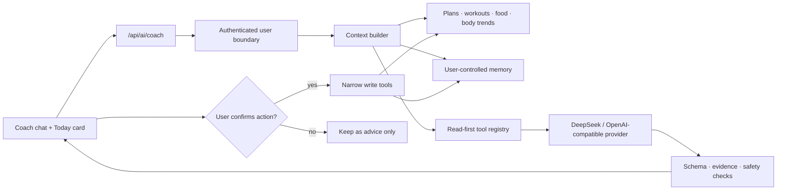

# LiftCut AI Coach Agent Blueprint

Status: proposed roadmap. The current production feature generates structured training and nutrition plans; the conversational agent described here is not shipped yet.

Implementation order updated 2026-09-28: follow the [Agent research roadmap](AGENT_RESEARCH_ROADMAP.md) and [progress log](AGENT_RESEARCH_PROGRESS.md). Evaluation and an offline environment now precede conversational product integration. This document remains the product boundary reference.

## Product goal

Turn LiftCut from a one-shot plan generator into a coach that can answer questions, remember useful user-approved facts, and recommend today's or the next training session from the user's own history.

The first useful version should be able to:

1. read the authenticated user's profile, active plans, recent workouts, food logs, and body trends;
2. explain what it used and which date range it considered;
3. propose one conservative next step plus an easier alternative;
4. ask before saving a memory, changing a plan, or writing any log;
5. keep general health information separate from diagnosis or treatment.

## Why this fits the existing codebase

LiftCut already stores nearly all of the factual context an MVP needs:

| Existing source | Coach context |
| --- | --- |
| `profiles` + `user_settings` | goals, experience, available equipment, preferences, limitations |
| active `training_plans` | intended weekly structure and exercise prescription |
| `workout_logs` + exercises | completion, load, reps, RPE, duration, recent adherence |
| `food_logs` + `nutrition_plans` | calorie/protein adherence and meal-plan context |
| `body_metric_logs` | weight and waist trends, treated as trends rather than daily verdicts |
| AI generation histories | prompt/model audit trail and previous generated plans |

`src/types/llm.ts` already defines a `PlanRecommendationInput` and `PlanRecommendationOutput`. The next step is therefore an orchestration and safety layer, not a second tracking product.

## Proposed architecture



The model never receives unrestricted database access. Server code builds a bounded context window and exposes narrow, typed tools. Read tools may run automatically; every material write is returned as a proposal and requires user confirmation.

## Memory model

Do not treat the full chat transcript as permanent memory. Separate four kinds of state:

1. **Source records:** existing workout, food, body, and plan rows remain the factual source of truth.
2. **Working context:** a short rolling summary of the last 7/28 days, regenerated from source records and allowed to expire.
3. **Durable memory:** stable goals, equipment, dietary preferences, schedule constraints, and user corrections. Each item records its source, confidence, expiry, and whether the user explicitly confirmed it.
4. **Conversation history:** thread messages for continuity, with clear retention and delete controls.

Proposed tables for a later migration:

| Table | Purpose | Important fields |
| --- | --- | --- |
| `coach_threads` | conversation containers | `user_id`, title, status, timestamps |
| `coach_messages` | user/assistant/tool turns | `thread_id`, role, content, tool metadata, model and prompt version |
| `coach_memories` | small durable facts | `user_id`, type, value JSON, source refs, confidence, confirmed, expires_at, status |
| `coach_recommendations` | auditable daily/next-session advice | context snapshot, evidence refs, structured recommendation, user decision |

All public-schema tables must have RLS enabled. Policies should target `authenticated` and combine it with `(select auth.uid()) = user_id`; update policies need both `USING` and `WITH CHECK`. Because newly created Supabase tables may not be exposed to the Data API automatically, the migration must also grant only the required operations to `authenticated`. No service-role or secret key belongs in the browser.

Embeddings and `pgvector` are optional for a later scale phase. The MVP can retrieve a small number of typed memories with ordinary indexed Postgres queries, which is easier to audit and delete correctly.

## Agent tools

Read tools available without extra confirmation:

- `get_profile_context()`
- `get_active_training_plan()`
- `get_recent_workouts(days <= 28)`
- `get_nutrition_summary(days <= 14)`
- `get_body_trends(days <= 28)`
- `get_confirmed_memories()`

Proposal tools that do not write:

- `propose_next_session()`
- `propose_daily_recovery_focus()`
- `propose_plan_adjustment()`
- `propose_memory()`

Write tools only after an explicit UI confirmation:

- `save_confirmed_memory()`
- `apply_plan_adjustment()`
- `save_check_in()`
- `delete_memory()`

Every tool validates ownership server-side and has a Zod input/output schema, a row limit, and a date-range limit.

## Structured response contract

The chat can sound natural while the server still requires structured output:

```json
{
  "message": "Natural-language answer shown in chat",
  "recommendation": {
    "type": "next_session",
    "summary": "Short actionable recommendation",
    "steps": [],
    "easier_alternative": "A lower-load option"
  },
  "evidence": [
    {
      "source": "workout_logs",
      "date_range": "last_14_days",
      "summary": "What the coach actually observed"
    }
  ],
  "safety": {
    "needs_professional_help": false,
    "reason": null
  },
  "proposed_actions": [
    {
      "tool": "apply_plan_adjustment",
      "requires_confirmation": true,
      "arguments": {}
    }
  ]
}
```

The UI renders the conversational message, evidence, safety notice, and proposed actions separately. A model cannot hide a write inside prose.

## Safety and privacy rules

- Never diagnose injuries, eating disorders, or medical conditions.
- Treat pain, fainting, chest symptoms, pregnancy, medication conflicts, and rapid unexplained weight change as escalation cases rather than optimization prompts.
- Prefer trend ranges over reacting to one weigh-in or one missed meal.
- Cite the user's actual records in recommendations; do not invent missing sleep, recovery, or nutrition data.
- Let users view, correct, delete, export, or disable memory.
- Store only durable facts needed for coaching; avoid copying sensitive free-form notes into long-term memory by default.
- Version prompts, model names, tool calls, validation failures, and user decisions for evaluation without logging secrets.

## Delivery phases

### Phase 1 — Today recommendation

Add a read-only daily card using the existing `PlanRecommendationInput` shape. It summarizes recent adherence and returns one recommendation with evidence. No new conversation tables and no write tools.

### Phase 2 — Conversation and memory

Add threads, messages, typed durable memory, rolling summaries, RLS policies, retention settings, and memory management UI.

### Phase 3 — Confirmed actions

Add narrow proposal/write tools. The assistant can suggest plan changes or check-ins, but the user previews and confirms every mutation.

### Phase 4 — Evaluation and maintainer automation

Build regression cases for missing data, conflicting goals, unsafe symptoms, prompt injection inside user notes, stale memory, and schema failures. Publish anonymized fixtures and evaluation scripts under `research/liftcut-coach`.

## MVP acceptance criteria

- A recommendation names the source records and date range it used.
- The same frozen context produces schema-valid output in automated tests.
- No unconfirmed request can change a plan, memory, or health log.
- Cross-user reads and writes fail under RLS tests.
- Users can inspect and delete every durable memory.
- Safety escalation fixtures never return an aggressive training or calorie adjustment.

This path keeps the first release useful and reviewable while leaving room for richer retrieval, local models, and proactive notifications later.
