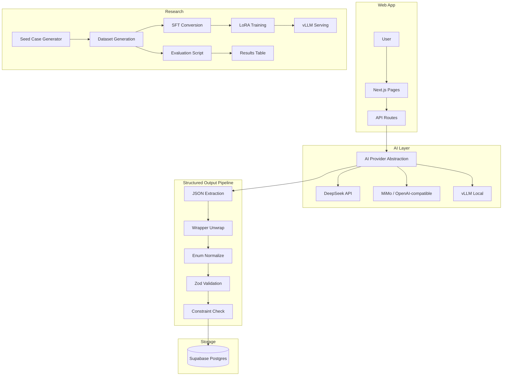

# LiftCut-Coach 技术报告

## 摘要

LiftCut-Coach 是 LiftCut Tracker 项目中的 AI 训练/饮食计划生成子系统。本文记录了从云端 API 调用到本地 LoRA 微调模型部署的完整技术路线，包括：多 Provider 抽象设计、结构化输出稳定性保障（strict prompt + wrapper unwrap + enum normalize + Zod schema validation）、Qwen2.5-14B-Instruct 上的 LoRA 微调（rank=16, 0.46% 参数）、vLLM OpenAI-compatible 本地部署、以及覆盖 DeepSeek / MiMo / LoRA 三个模型的 evaluation pipeline。在 293 条 held-out evaluation cases 上，LiftCut-Coach LoRA 达到 100% Final Zod Schema Pass 和 99.66% Constraint Pass，wrapper key / enum error 均为 0。

---

## 1. 项目背景与问题定义

传统健身记录软件存在以下问题：

- **数据割裂**：训练记录、饮食记录、体重数据分散在不同平台，缺乏统一视图
- **AI 生成不可靠**：大语言模型（LLM）输出的 JSON 可能包含非法结构、包裹层、错误枚举值
- **前端/数据库需要可验证结构**：直接将 LLM 输出写入数据库会导致前端渲染崩溃
- **成本与隐私**：云端 API（如 DeepSeek）按 token 计费，用户数据经过第三方服务器
- **延迟**：云端 API 的 P95 延迟可能超过 200 秒，影响用户体验

因此，我们需要一个完整的工程化方案，把不稳定的 LLM 输出转化为前端和数据库可稳定消费的数据结构。

---

## 2. 系统目标

1. **构建真实可用的 Web App**：Next.js + Supabase，支持训练、饮食、身体指标追踪
2. **结构化 AI 生成**：训练计划和饮食计划必须通过严格 Zod schema 验证
3. **多 Provider 支持**：DeepSeek（生产）、MiMo/OpenAI-compatible（备选）、本地 vLLM（研究/演示）
4. **本地 LoRA 模型**：微调一个面向 LiftCut 场景的小模型，替代云端 API
5. **可量化评测**：建立 evaluation pipeline，量化 JSON pass rate、constraint satisfaction、latency

---

## 3. 总体架构



---

## 4. AI Provider 抽象设计

### 4.1 为什么需要 Provider Abstraction

- 生产环境用 DeepSeek，研究/演示用本地模型
- 不同 Provider 的 API 格式兼容（OpenAI Chat Completions），但 timeout、延迟、成本不同
- 前端不应该感知后端用的是哪个 Provider

### 4.2 三种 Provider

| Provider | 用途 | 配置 |
|---|---|---|
| `deepseek` | 生产默认 | `DEEPSEEK_API_KEY`, `DEEPSEEK_BASE_URL`, `DEEPSEEK_MODEL` |
| `local` | 研究/演示 | `LOCAL_AI_BASE_URL`, `LOCAL_AI_API_KEY`, `LOCAL_AI_MODEL` |
| `openai_compatible` | 通用兼容 | `AI_BASE_URL`, `AI_API_KEY`, `AI_MODEL` |

### 4.3 Provider-Specific Timeout

不同 Provider 的响应速度差异巨大：

- DeepSeek P50: 133s, P95: 277s
- MiMo P50: 35s, P95: 66s
- LoRA (vLLM) P50: 33s, P95: 63s

如果全局使用 30s timeout，本地 LoRA 模型会频繁超时。因此实现了 provider-specific timeout：

- `deepseek` 默认 30s（`DEEPSEEK_REQUEST_TIMEOUT_MS` 可覆盖）
- `local` 默认 120s（`LOCAL_AI_REQUEST_TIMEOUT_MS` 可覆盖）
- `openai_compatible` 默认 30s（`AI_REQUEST_TIMEOUT_MS` 可覆盖）
- `AI_REQUEST_TIMEOUT_MS` 作为通用覆盖

---

## 5. 结构化输出稳定性设计

LLM 输出不稳定是核心工程问题。我们的解决方案是多层防线：

### 5.1 Strict Prompt

在 system prompt 中明确约束：

- 顶层 JSON 必须直接包含 `plan_name`, `goal_type`, `summary`, `warnings`, `daily_targets`, `days`
- 禁止包裹在 `nutrition_plan`, `meal_plan`, `plan`, `data`, `result`, `output` 等 key 中
- `meal_type` 必须是 `breakfast`, `lunch`, `dinner`, `snack`，禁止中文
- `goal_type` 必须是 `fat_loss`, `muscle_gain`, `maintenance`, `recomposition`

### 5.2 JSON Extraction

从模型输出中提取第一个完整的 JSON 对象，处理 code fence、前导文字等情况。

### 5.3 Wrapper Unwrap

检测并解包常见的包裹层：

```typescript
function unwrapNutritionPlanCandidate(value: unknown): unknown {
  if (value && typeof value === "object" && "nutrition_plan" in value &&
      typeof (value as Record<string, unknown>).nutrition_plan === "object") {
    return (value as Record<string, unknown>).nutrition_plan;
  }
  return value;
}
```

### 5.4 Enum Normalization

`normalizeMealType` 支持中文别名到英文枚举的 deterministic 映射：

- 早餐/早饭/早 → `breakfast`
- 午餐/午饭/中餐/中饭 → `lunch`
- 晚餐/晚饭 → `dinner`
- 加餐/零食/点心 → `snack`
- 包含式匹配：「高蛋白早餐」→ `breakfast`

### 5.5 Final Zod Schema Validation

经过 normalize 后，用严格 Zod schema 做最终校验。**不放宽 final schema**——它保护前端和数据库的数据稳定性。

### 5.6 Constraint Satisfaction Checking

在 schema 通过后，额外检查业务约束：

- 训练计划：每周天数是否匹配、每天时长是否在合理范围
- 饮食计划：`daily_targets` 是否存在且在合理范围、`meal_type` 是否合法

---

## 6. 数据与训练流程

### 6.1 Seed Case Generation

`generate_seed_cases.ts` 程序化生成 ~3000 条多样化 seed cases，覆盖：

- 4 种 goal type × 3 种 experience × 3 种 location × 4 种 training days × 2 种 locale
- 17 种身体模板（不同性别、年龄、体重）
- 15 种伤病模板、11 种生活方式模板、11 种食物限制模板

### 6.2 Dataset Generation

用 DeepSeek / MiMo API 批量生成训练数据。每条输出经过完整 pipeline（prompt → JSON → unwrap → normalize → Zod schema）验证。支持断点续传。

最终生成 2927 条有效样本（成功率 97.2%）。

### 6.3 SFT Conversion & Split

将 examples 转为 LLaMA-Factory Alpaca 格式（`instruction`, `input`, `output`），按 80/10/10 切分：

- Train: 2341
- Validation: 293
- Test: 293

### 6.4 LoRA Training

- **Base model**: Qwen2.5-14B-Instruct（28GB, 14.8B 参数）
- **Method**: LoRA, rank=16, alpha=32, target=all linear modules
- **Trainable params**: 68,812,800（0.46% of total）
- **Adapter size**: ~275MB
- **Training**: 3 epochs, batch_size=2, gradient_accumulation=4, lr=2e-5, cosine scheduler
- **Runtime**: ~5h47m on A800-SXM4-80GB
- **Train loss**: 0.7436 → 0.3704（下降 50.2%）

> 注：eval loss 未记录（LLaMA-Factory 配置问题），因此无法严格判断泛化能力。需通过 held-out test set 评测补充验证。

---

## 7. vLLM 本地部署

使用 vLLM 0.7.3 提供 OpenAI-compatible API：

```bash
python -m vllm.entrypoints.openai.api_server \
  --host 0.0.0.0 --port 8000 \
  --model /workspace/models/Qwen2.5-14B-Instruct \
  --served-model-name qwen14b-base \
  --enable-lora \
  --lora-modules liftcut-coach=/workspace/outputs/liftcut-coach-qwen14b-lora-v2 \
  --max-model-len 4096 --gpu-memory-utilization 0.85
```

注册两个模型：`qwen14b-base`（不带 LoRA）和 `liftcut-coach`（带 LoRA）。

**遇到的问题**：vLLM 0.24.0 需要 PyTorch 2.11+cu130，但系统 CUDA driver 是 12.2。降级到 vLLM 0.7.3 + PyTorch 2.5.1+cu121 解决。

---

## 8. Evaluation Pipeline

### 8.1 指标定义

| 指标 | 含义 |
|---|---|
| JSON parse success | 模型输出能否被 `JSON.parse` |
| Raw schema pass | 能否通过宽松 raw schema |
| Normalized schema pass | unwrap + normalize 后能否通过 |
| Final Zod schema pass | 能否通过严格 final schema |
| Constraint satisfaction | 业务约束是否满足（天数、时长、宏量） |
| Wrapper key errors | 是否包含 `nutrition_plan` 等包裹 key |
| Enum errors | `meal_type` 是否为非法值 |
| Latency avg/p50/p95 | 延迟统计 |
| Per-task breakdown | training/nutrition 分别统计 |
| Failure stage breakdown | 失败按 stage 分类 |

### 8.2 评测流程

1. 将 test set（Alpaca 格式）转为 eval 格式
2. 对每个 eval case，走完整 pipeline：prompt → API call → JSON extract → raw schema → normalize → final schema → constraint check
3. 记录每条结果到 `.results.jsonl`，失败条目到 `.failed.jsonl`
4. 输出 Markdown summary table

---

## 9. 实验结果

### 9.1 三模型对比

| Model | JSON Parse | Final Schema | Constraint Pass | Wrapper Errors | Enum Errors | Avg Latency | P50 | P95 |
|---|---:|---:|---:|---:|---:|---:|---:|---:|
| DeepSeek v4 Pro | 99.66% | 97.95% | 97.95% | 0 | 0 | 147.7s | 133.6s | 277.4s |
| MiMo v2.5 Pro | 99.32% | 98.29% | 97.27% | 0 | 0 | 38.7s | 35.3s | 65.6s |
| LiftCut-Coach LoRA | 100.00% | 100.00% | 99.66% | 0 | 0 | 36.8s | 33.0s | 63.3s |

### 9.2 Per-task Breakdown

| Task | DeepSeek Pass | MiMo Pass | LoRA Pass |
|---|---:|---:|---:|
| Training (140 cases) | 95.71% | 94.29% | 99.29% |
| Nutrition (153 cases) | 100.00% | 100.00% | 100.00% |

### 9.3 分析

- **LoRA schema pass 最好**：100% Final Schema Pass，是三个模型中唯一零 schema 错误的
- **MiMo 延迟远快于 DeepSeek**：平均 39s vs 148s，快 3.8 倍
- **LoRA 延迟接近 MiMo**：37s vs 39s，差异不大
- **Training plan 比 nutrition plan 更难**：三个模型的 training 失败率都高于 nutrition
- **Schema pass ≠ Constraint pass**：LoRA 的 schema pass 是 100%，但 constraint pass 是 99.66%（1 条 training case 失败）

---

## 10. 工程问题与解决

### 10.1 JSON 合法但 Schema 不合法

**问题**：模型输出合法 JSON，但字段缺失、类型错误、或结构不对。

**原因**：LLM 不理解 Zod schema 约束，只理解自然语言 prompt。

**解决**：strict prompt 明确列出 required fields 和 forbidden patterns；raw schema → normalize → final schema 三层过滤。

### 10.2 Wrapper Key 问题

**问题**：模型有时把结果包在 `nutrition_plan`、`meal_plan`、`data` 等 key 里。

**原因**：训练数据中可能有这样的格式；模型倾向于给输出加一个"容器"。

**解决**：
1. Prompt 层明确禁止
2. `unwrapNutritionPlanCandidate` 在 normalize 前自动解包
3. Final schema 不放宽，作为最后防线

### 10.3 中文 meal_type Enum 问题

**问题**：模型输出「早餐」「午餐」「晚餐」「加餐」，但 schema 只接受英文枚举。

**原因**：locale 是 zh-CN 时，模型倾向于用中文输出所有内容。

**解决**：
1. Prompt 层明确要求 `meal_type` 必须是英文
2. `normalizeMealType` 支持中文别名到英文的 deterministic 映射（包含式匹配）

### 10.4 Latency P50/P95 统计 Bug

**问题**：评测报告中 P50 和 P95 显示相同值。

**原因**：代码中 P50 错误调用了 `p95()` 函数，且没有定义 `p50()` 函数。

**解决**：改为通用 `percentile(values, p)` 函数，P50 调用 `percentile(latencies, 0.50)`，P95 调用 `percentile(latencies, 0.95)`。

### 10.5 Local LoRA Timeout 问题

**问题**：Web App 调用本地 vLLM 时频繁超时。

**原因**：原 timeout 是 30s，但 LoRA P95 延迟是 63s。OpenAI SDK 默认重试 2 次，总等待 ~90s 后超时。

**解决**：实现 provider-specific timeout。`local` provider 默认 120s，通过 `LOCAL_AI_REQUEST_TIMEOUT_MS` 可覆盖。

### 10.6 Supabase Env 阻塞 Web App Smoke Test

**问题**：Web App API route 返回 500。

**原因**：`.env.local` 中 `NEXT_PUBLIC_SUPABASE_URL` 和 `NEXT_PUBLIC_SUPABASE_ANON_KEY` 为空。API route 在 guest 模式下也需要初始化 Supabase client。

**解决**：这是环境配置问题，不是代码问题。需要补充 Supabase 环境变量后重新测试。

---

## 11. 项目价值

### 11.1 产品角度

- 真实可用的 AI 健身助手
- 用户训练、饮食、体重数据闭环
- AI 生成 → 预览 → 编辑 → 确认保存的完整流程
- 支持游客模式，降低使用门槛

### 11.2 工程角度

- Full-stack Web App（Next.js + Supabase）
- Provider abstraction，支持多 AI 后端无缝切换
- 结构化输出的多层保障（prompt + unwrap + normalize + schema + constraint）
- 完整的 evaluation pipeline，量化模型质量
- vLLM 本地部署，OpenAI-compatible API

### 11.3 研究角度

- LoRA 微调（rank=16, 0.46% 参数）显著提升结构化输出稳定性
- 本地小模型（14B + LoRA）在特定任务上可超越云端大模型
- 建立了可复现的 eval pipeline 和数据切分方案

---

## 12. 局限与未来工作

1. **评测规模有限**：293 条 held-out cases 仍需更多真实用户验证
2. **Eval loss 缺失**：训练过程中未记录 eval loss，无法严格判断过拟合
3. **GPU 依赖**：LoRA 本地部署需要 A800/A-series GPU，无 GPU 时需回退到云端 Provider
4. **Normalize 审计**：`Normalized schema pass < Raw schema pass` 的指标定义需要进一步审计
5. **小模型探索**：可尝试 7B/3B 小模型降低部署成本
6. **Streaming**：当前是同步生成，可加入 streaming generation 提升用户体验
7. **用户反馈**：可加入 feedback loop，收集用户对 AI 计划的评价用于迭代
8. **E2E 测试**：补充 Supabase env 后重新跑 Web App API smoke test
