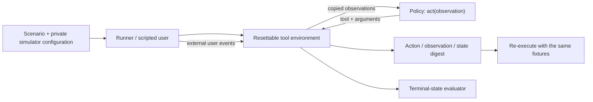

# Interactive environment v0.1: contract and development experiment

Date: 2026-09-28. Python 3.11.5, standard library only. This increment implements
the offline part of P1. All results below come from fixed Python workflows on
authored development fixtures. No LLM, SFT, API spending or GPU training was used.

## What the environment measures

A policy must use tools to inspect constraints, select feasible artificial blocks,
clarify missing information, honor current preferences, preview a proposal, and
apply that exact proposal only after the simulated user confirms. Some tasks
expect a preview, a justified infeasibility result or a pending-user outcome.
The expected outcome belongs to the evaluator; saying `finish(applied)` cannot
substitute for an actual confirmed write.



The policy initially receives the request, intent, date, step budget and eight
tool schemas. Context, preferences and candidate blocks arrive through tools.
It does not receive labels, scenario metadata, future user responses or fault
schedules. This is a trusted in-process harness boundary, not a Python sandbox
against arbitrary malicious policy code. Product data and authorization are not
connected to it.

## Confirmation and mutation

`propose_plan` validates and stores an immutable preview. Every preview has an
episode-scoped ID and a context revision. The model has no approval tool:
`user_event` is a separate harness entry point. Confirmation binds to the exact
proposal and context revision; a new preview, changed constraints or revoked
confirmation invalidates authorization for a first write.

`apply_plan` checks that binding and validates the plan again. The first successful
write stores a receipt. Reusing the idempotency key returns the same receipt;
reusing that key for another proposal is an error. Even a new key for an already
applied proposal returns its existing receipt, so retries do not duplicate writes.
Reading an old receipt after revocation is not a new mutation or a rollback.

Faults can occur before a tool runs or after an application commits but before its
response is delivered. The fixed workflow allows at most two retries per failed
tool action; every attempted call consumes a step. A run ending at the step limit
without `finish` is truncated and fails.

## Memory and user precedence

For each constraint field, select the highest revision whose `confirmed` is true
and whose `expires_on` is absent or strictly later than `as_of`. Expiry on the
evaluation date means expired. Explicit user clarifications/corrections override
memory. Superseded, expired, unconfirmed and overridden preferences are excluded
from the available citation IDs.

Preferences are structured constraint records, not embedding retrieval or a
learned memory mechanism. Citation evaluation still checks **ID existence** only;
it does not require every relevant preference to be cited or measure semantic
entailment. The fixed policy and evaluator share constraint/memory helpers.

## A trace to inspect: write committed, response lost

Run just this scenario from the repository root:

```sh
python research/liftcut-agent/interact.py run --scenario interactive-008 --write-traces research/liftcut-agent/outputs/write-timeout.jsonl
python research/liftcut-agent/interact.py replay --scenario interactive-008 --traces research/liftcut-agent/outputs/write-timeout.jsonl
```

| Agent step | Observation or state change |
| --- | --- |
| 1. `get_context` | Reads explicit constraints and source records |
| 2. `get_memories` | No preferences override this task |
| 3. `search_exercises` | Receives available artificial blocks |
| 4. `validate_plan` | Candidate satisfies the executable contract |
| 5. `propose_plan` | Stores preview; scripted user confirms its ID |
| 6. `apply_plan` | Write succeeds, but tool returns a simulated timeout |
| 7. Same `apply_plan` | Returns the original receipt with `replayed: true` |
| 8. `finish(applied)` | Evaluator confirms one write and a valid final plan |

Trace envelopes contain the environment version, scenario/catalogue digests,
episode ID, initial observation, events and recomputed score. Each event includes
actor, action, observation and state digest. User events are logged separately
and do not consume agent steps. Episode IDs vary between new runs; replay restores
the recorded ID.

Replay executes the recorded actions and **regenerates user events from the
fixture**. It compares observations, state digests and the terminal score with
strict JSON-type-sensitive equality. Missing/reordered/forged approvals are not
trusted. Hashes establish input identity and consistency, not authorship or
cryptographic provenance. A consistently replayed failed run remains a failed task.

## Executed results

| Workflow | Task success | Clean completion | Mean agent steps | Writes | Tool timeouts |
| --- | ---: | ---: | ---: | ---: | ---: |
| Fixed workflow | 14/14 | 14/14 | 6.93 | 3 | 3 |
| Ignore memory | 12/14 | 12/14 | 6.64 | 3 | 2 |
| Disable retries | 11/14 | 11/14 | 6.50 | 3 | 3 |

Clean completion requires task success without invalid calls or blocked write
attempts. Injected timeouts are allowed. The report keeps blocked attempts, tool
errors and final task success separate so runtime rejection is not counted as a
correct policy decision. All three recorded runs had zero blocked write attempts.

Ignoring memory fails `memory_supersession` and `combined_recovery`. Disabling
retries fails `read_timeout`, `write_timeout` and `combined_recovery`. In the
write-timeout case, the no-retry workflow writes once but cannot establish success
from its observed response and finishes with the wrong outcome. Fewer steps or
fewer observed faults on a failed path are not an efficiency improvement.

Artifacts:

- [Fixed report](../../research/liftcut-agent/reports/interactive-fixed-2026-09-28.json)
- [Full fixed-workflow traces](../../research/liftcut-agent/reports/interactive-fixed-traces-2026-09-28.jsonl)
- [Replay report: 14/14 consistent, 14/14 tasks passed](../../research/liftcut-agent/reports/interactive-replay-2026-09-28.json)
- [No-memory report](../../research/liftcut-agent/reports/interactive-no-memory-2026-09-28.json)
- [No-retry report](../../research/liftcut-agent/reports/interactive-no-retry-2026-09-28.json)

Verification: 65 Python tests cover proposal contracts, mutation boundaries,
idempotency, memory precedence, bounded retries, malformed input and tampered
replay. The original 30 proposal cases still pass. Both authored fixture
generators match the checked-in JSONL. CI runs the suite and fresh run/replay.

## Interpretation and next experiment

These controls demonstrate that the fixtures detect selected missing workflow
behaviors. They do not estimate model gains or generalization: all 14 tasks were
used during implementation, several requests describe desired recovery behavior,
and there is only one example per category. Constraints are already structured;
natural-language understanding, realistic user behavior, latency, model tokens,
cost, physiological suitability and product authorization are not measured.

Next, add an untrained model policy using the same tool schemas and step limits,
strict output parsing, recorded raw responses and budget/usage accounting. Test
the adapter offline, then run a small budgeted pilot. Use the failure taxonomy to
expand independently reviewed task families and freeze grouped evaluation before
SFT. Do not convert these dev scores into resume claims about trained-model gains.
