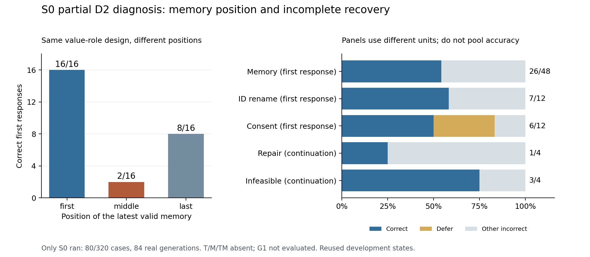

# D2 部分结果、控制器故障与下一次执行

这轮只有 S0 完成了 80 例，产生 84 次真实生成；T/M/TM 共 240 例没有运行。
因此可以定位 S0 的行为短板，但不能报告四组效果、推断 T/M 训练收益或触发 G1。
这不是一次完整 D2 实验。原始记录、独立回放结果见[公开证据](../../research/liftcut-agent/reports/d2-partial-s0-2026-10-02/README.md)。

## 已核验的结果

| 面板 | 正确 | 其他观察 | 评分单位 |
| --- | ---: | --- | --- |
| 记忆 | 26/48 | 20 次选旧有效记忆，2 次选无效干扰记忆 | 首响应；接受的工具批次全部执行 |
| ID 改写 | 7/12 | 对应原始 12 例也是 7/12，但有两例相反翻转 | 首响应，语义不变的 ID 双射 |
| 授权 | 6/12 | 4 次 defer，2 次错误结束；没有自主越权写入 | 首响应，不是完整任务成功率 |
| 可修复校验错误 | 1/4 | 3 次未修好目标字段就结束等待用户 | 最多 8 请求的完整续接 |
| 真不可行 | 3/4 | 1 次错误结束为 awaiting_user | 最多 8 请求的完整续接 |

这些面板的评分单位不同，不汇总成一个整体准确率。已完成 S0 内没有缺失案例，
未运行的其他三组仍保留在全研究 320 例分母中；它们不是观察到的模型错误答案。

### 记忆短板：位置比器械值更能解释这组失败

最新有效记忆放在 first/middle/last 的正确数分别为 **16/16、2/16、8/16**。
四种值角色轮换各为 7/12、6/12、6/12、7/12；有/无澄清历史为 14/24、12/24。
无效干扰类型为过期时 16/24，为未确认时 10/24。每个分组的逐例清单都在 review.json。

48 次实质选择中，26 次取最新有效值，20 次取旧有效值，2 次取无效干扰值，没有
取原始输入值。**这些固定状态下，模型仍明显受呈现位置影响，且多数错误没有正确
按有效性和新旧版本取舍。** 值轮换后的分数相近，使“只是偏爱某种器械”不足以
解释这里的主要差异。以上是行为诊断，不能据此断言内部注意力机制或独立泛化能力。

### ID 总分相同不表示行为稳定

原始 rotation0 的 12 例和对应 ID 改写题都为 7/12，但：

- `v0-c1-middle-unconfirmed` 从正确变错误。
- `v0-c1-middle-expired` 从错误变正确。

逆映射 ID 后比较完整自主动作序列，同样是这两例变化。净分为零会隐藏这两个
方向相反的变化。后续仍按固定四组逐例配对，不凭汇总分判断处理组可靠性。

### 授权与纠错需要区分“多读一步”和“错误结束”

所有四个 context 历史授权题的首响应都是 `get_memories`，因此记作 defer；
pending 的 plain/memories 两题直接 `finish(previewed)`，是错误决定。不能把这
六例统称越权：这轮没有自主越权写入，也不能把 defer 自动解释成后续一定会正确。

两个 `unknown_evidence` 变体都请求澄清 `evidence_ids`，工具返回
`unnecessary_clarification` 后，模型仍结束为 `awaiting_user`。这不是“用户没提供
资料”的真实缺失，而是没有利用已有记录修复引用。`session_count_mismatch-v0`
成功执行校验、预览和结束；v1 直接等待用户，目标字段未修。真不可行的 v1 同样
错误等待，提示还应区分“可修复/不可行/确实需要用户输入”三种终态。

原 G1 门槛针对固定 **T** 的两个原定错误族，不针对 S0。T 未运行，所以本轮不能
计算该触发，更不能依据这轮 S0 直接开始训练或换一个门槛。

## 控制器为什么中断

云端仍按事先冻结的 `06654db287a5d51c4aad6bf57fcee40d21555afc` 执行。
S0 于 08:44:27 UTC 开始，08:48:15 完成。随后已经生成 `s0.tar.gz`，但写
early-index 时，调用同时传入日志文件位置和名为 `path` 的归档字段；`event_file`
首个形参也叫 `path`，Python 抛出 `TypeError: ... multiple values for argument 'path'`。
因此 T 尚未启动就进入部分归档和关机路径。这是我的控制器集成缺口，不是推理
超时、模型加载失败或预算不足。

之前的 CPU 演练复制了另一段写 early-index 的代码，没有经过实际出错的 helper。
大量单项测试通过，仍漏掉了生产组间交接路径。修复不只是换一个参数名：

1. 将日志目标参数改为 `destination`，让 `path` 作为事件字段正常落盘。
2. 将生产阶段循环抽成 `execute_phases`，真实运行和 CPU 演练共用四组归档登记与
   最后审计顺序，避免再次维护两份相似流程。
3. 新增使用真实临时 Git/归档文件的集成检查：每个下一组开始前，上组索引已写入，
   四份归档可恢复；任何 worker 失败都不能继续下一组或生成伪完成索引。
4. 保留原 v1 来源清单；新增[执行准备 v2](../../research/liftcut-agent/reports/d2-execution-readiness-v2.json)。
   自动比较除来源 SHA 外的全部科学参数必须一致，且只允许指定的控制/部署源码
   改动。题目、顺序、权重、精度、采样、token、校准、预算、评分和 G1 门槛不变。

v2 CPU 演练已经完成真实 tokenizer/native/environment 的 320 例、352 条脚本响应、
272 次预算复算、4 份真实归档登记，以及实际权重恢复/真实生成的脚本回执/模拟关机。
它仍是 oracle 演练，不冒充新的模型结果；详见[演练报告](../../research/liftcut-agent/reports/d2-operating-drill-v2-2026-10-02.json)。
全部465项本地测试通过，用时157.652秒；CI 使用的公开数据/token复现路径也已在
本机通过，明确不包含私有权重核验。最终提交的远端检查另由交付 PR 保留。

## 恢复、关机和费用

部分归档 316,676 字节、15 个清单文件于 08:48:45–48 UTC 通过真实完整性恢复。
**当时生成的回执仍如实声明：0 个案例回放、无完整权重/token审计、研究未完成。**
08:48:52.122279 临时回执读回核验及原子重命名成功；08:48:52.195847 SSH 断连。
随后的一次只读进程检查连接被拒绝，没有实际远端命令执行。没有再次开机或重启。

服务器是否消费了回执、关机命令返回值、平台停止计费都未直接捕获。平台状态和
实际费用已向用户询问；断连不代替平台证据。按开机代理至断连 432.636348 秒计算，
本轮算力成本代理 **¥0.2620**，不含存储；之前启动失败代理 ¥0.6463，两次合计约
¥0.9083，均不当作账单。

之后在本机另做了 S0 的真实 80 例回放、84 次生成的 token 重建、原 seed42 全部
8 个 adapter 文件核验，并验证旧窗口的 68 次吞吐估计。这个新增审计**没有修改或
升级已发布的部分回执**，也没有补造其他三组数据。CI 只复现公开数据/token，不
重新验证未公开权重；两种验证范围分别报告。

## 下一次具体做什么

下一次是修复后的**新完整 D2 窗口**，仍按 S0/T/M/TM 各 80 例，共 320 例、最多
544 次调用执行。重新跑 S0，使正式四组共享 v2 控制器及同一开机窗口；本轮 S0
保留为独立列出的失败窗口部分观察，不按分数选择保留哪次，也不拼成伪完整旧运行。
只有新 D2 完整恢复之后才报告四组配对效果与 T 的原 G1 门槛。

部署改为**依赖已存在的干净 06654db checkout 的增量 Git bundle**：本地真实 Git
测试已确认只复制旧 checkout 到新路径、离线应用新对象、核验最终完整提交，旧
checkout 不变。开机前还必须对最终发布提交生成的真实包做一次离线安装，记录
总字节量；不能再让租用中的服务器等完整仓库上传。若基底缺失/变脏则停止，不
擅自下载或延长窗口。新入口由配置与 stage 共同绑定精确受检提交和 v2 清单哈希。

预留仍 **¥5/新窗口**，参考 ¥2.18/小时，90 分钟工作、120 分钟硬截止，10 分钟
内未启动则关机，存储另计且不自动扩盘。S0 本次阶段约 228 秒，84 次生成合计约
198 秒，中位数 2.12 秒；据此估计全流程约 20–35 分钟，但这只是执行安排，后续
各组仍服从原固定校准和停止规则，不保证耗时相同。前两次成本另外留账。

最终精确提交全部 CI 通过、合并、实际增量包安装验证完成后，再通知用户开机。
当前不启动 G1、额外 seed、付费 API 或 48 个保留题。若完整 D2 仍不支持训练干预，
就按原计划冻结候选和独立验证，不靠不断扩训堆出漂亮数字。

**学习检查：** 用两个 ID 翻转解释为什么净增为零不等于不敏感；手动跟踪一个
`unknown_evidence` 变体，说明为什么正确回复应修复引用而非询问用户；解释
80 例追加审计为什么不能把原部分回执改成“完整研究已恢复”。
