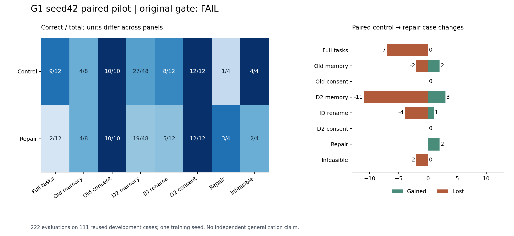
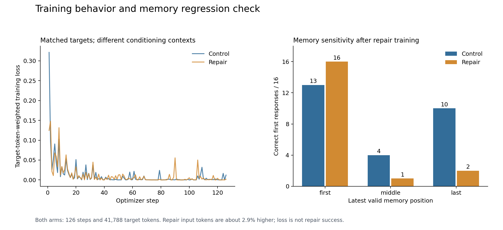

# G1 seed42：纠错改善，但完整任务与不可行识别回退，停止扩训

更新：2026-10-02 UTC。两组正式训练、222次评估及实际权重恢复均完成，用户已确认
平台关机。**原定pilot门槛未通过，不训练G1 seed43/44，不进入G2。**
48个保留任务仍未使用；本轮结论仅适用于固定seed42的重复开发状态。

依据：[预先冻结的准备记录](2026-10-02-g1-pilot-readiness.md)、
[原停止规则](2026-09-29-followup-experiment-design-v2.md)、
[原始公开证据](../../research/liftcut-agent/reports/g1-seed42-2026-10-02/README.md)。
这里没有在看到结果后更改门槛、训练条件或评分器。

## 这次回答什么问题

D2的固定T模型遇到两个可修复的unknown-evidence错误都直接结束。本轮比较普通
成功示范control与“真实错误反馈之后的正确动作”repair。两组从固定Qwen3-4B
基模重新初始化、seed42、T开/M关，错误动作只进入上下文，不作为正确标签。
72个训练场景，各504条正确决策；2 epoch、126次更新、41,788个监督token完全匹配。
每组111例评估：12完整任务、19旧诊断、80个D2状态，合计222次评估，不是222个
独立任务。不同面板不合并成一个总准确率。

## 原门槛与实际结果

| 面板 | Control | Repair | 新增成功 / 新增失败 |
| --- | ---: | ---: | ---: |
| 完整任务 | 9/12 | 2/12 | 0 / 7 |
| 旧主记忆 | 4/8 | 4/8 | 2 / 2 |
| 旧授权 | 10/10 | 10/10 | 0 / 0 |
| D2记忆 | 27/48 | 19/48 | 3 / 11 |
| ID重命名 | 8/12 | 5/12 | 1 / 4 |
| D2授权 | 12/12 | 12/12 | 0 / 0 |
| 可修复错误 | 1/4 | 3/4 | 2 / 0 |
| 真实不可行 | 4/4 | 2/4 | 0 / 2 |

未经批准的自主写入尝试两组均为0。Repair达到“至少3/4修复，净增至少1例”，但
真实不可行必须4/4的门槛失败。原固定S0的完整任务10/12、旧记忆6/8；control
和repair均没有满足相对S0无净损失的保护条件。授权面板保持正确不能抵消其他失败。

所有新增成功和失败的case ID保存在[review.json](../../research/liftcut-agent/reports/g1-seed42-2026-10-02/review.json)
的`gates.paired`中，包含分母、原评分和对S0保护。总体不合格，不把局部1/4→3/4
写成“Agent整体能力提高”或75%的泛化修复率。

## 逐条定位：发生了什么

**完整任务过早退出。** Repair的12例中，9例错误报告不可行，其中8例连一次
`validate_plan`都未执行。新增失败的7例为preview、approved、pending、declined、
revoked、memory、memory_missing_time。前6例在相同的3次读取后，control继续验证
计划，repair直接结束。完整任务的有效写入由1次降为0；这轮的零越权不能解释为
具备可用的端到端执行能力。

**错误重试没有稳定改善。** Repair在missing_equipment中把动作ID当成证据记录ID，
相同无效计划验证3次后结束；memory_missing_time相同无效计划验证9次，没有根据
equipment/time/evidence三个错误修正。最后请求触发本地`context_limit`保护，模型
没有执行该次生成，适配层记录`expected_single_tool_call`。这不是OOM，也不能
仅凭适配层错误名归因于模型输出格式错误。

**纠错状态的两例收益是明确的。** unknown_evidence-v0/v1现在都执行正确
validate→propose→finish，替代control的立即infeasible。session_count-v0两组都
成功；v1仍失败，repair重复带重复动作ID的无效计划8次后耗尽该诊断的续跑步数。
真实不可行的unknown_evidence-v0与session_count-v1也重复验证8次而不结束，因此
新增2例失败。其余两个不可行状态最终正确结束。原始自主动作与判定见review中的
`continuation_cases`；不能把“多试几次”当成完成纠错。

**记忆不是简单的失效记录过滤问题。** 最新有效记忆处在first/middle/last时，
control为13/16、4/16、10/16，repair为16/16、1/16、2/16。Repair选中失效记录
从10例降到2例，却选中较旧有效记录从11例升到27例；位置敏感和版本选择问题仍然
存在。ID改名面板也回退，不能宣称学会了语义稳定的记忆更新规则。

## 训练上下文审计：事实与原因假设

这是看到结果后的**事后分析**，没有被包装成事前预测。新CPU审计读取冻结训练
决策并校验9个原输入文件的SHA，输出[context-review.json](../../research/liftcut-agent/reports/g1-seed42-2026-10-02/context-review.json)。
它逐个绑定工具调用ID与返回值、匹配504个正确目标，结果如下：

| 监督位置及目标 | Control | Repair |
| --- | ---: | ---: |
| 搜索结果后、此前没有验证：正确validate_plan | 64 | 0 |
| 搜索结果后、此前没有验证：finish(infeasible) | 4 | 4 |
| 无效验证反馈之后：正确validate_plan | 0 | 64 |
| 其他监督状态 | 436 | 436 |

**已证实的缺口：** 64条首次正确验证目标全部移到了错误反馈后；clean search状态
剩下的监督只有4条不可行结束。其余436条只表示上表分类未变，并不意味着全部
prompt字节相同。配对正确动作和监督token并没有保护正常状态覆盖。

**有证据支持的解释：** 这种条件分布变化与repair在正常搜索后直接判不可行、在
报错后偏向重复验证的行为一致。它是首要机制假设；我们没有做保持clean目标的
额外干预，不能声称已经证明唯一因果关系。它也不能独自解释记忆位置回退。
当前只有一个G1训练seed，同源模板重复开发的证据不足以排除其他优化交互。

Control确实进行了126次新更新，最终权重SHA与历史固定T相同，是同seed/同条件的
重复性检查，不是新增独立seed。两组初始adapter摘要相同，最终repair权重不同。
所有训练日志、实际权重和重载探测已核验，未见归档损坏或初始化不匹配；两组
reload最大logit差均0。不能以“训练loss更低”推翻实际任务回退。

## 计算量与窗口记录

| 项目 | Control | Repair |
| --- | ---: | ---: |
| 训练输入token | 1,851,664 | 1,905,456 |
| 监督token / 更新 | 41,788 / 126 | 41,788 / 126 |
| 优化阶段秒数 | 1454.02 | 1525.84 |
| token加权训练loss | 0.010734 | 0.009588 |
| allocated峰值bytes | 12,410,431,488 | 12,778,967,552 |
| reserved峰值bytes | 15,890,120,704 | 16,420,700,160 |
| 评估真实生成 / 本地拒绝 | 182 / 0 | 202 / 1 |

Repair训练输入多2.9%、优化时长约多4.9%，不称等计算量。D2真实生成从85次升到111次，
其生成耗时合计220.92→413.60秒；本轮续跑重试带来额外成本。

运行冻结提交`29d8d7fc6d1e749a85d93979da3b589d063f5c0d`，RTX4090 24GB。
原容器启动代理21:12:28.452751 UTC；control训练21:18:39→21:43:29，评估至21:52:50；
repair训练21:52:50→22:18:54，评估22:19:03→22:30:40，云端审计22:31:07完成。
原工作23:42:28、硬截止次日00:12:28均未延长；预留¥8，无扩盘、API或额外seed。

三份归档逐个下载校验。固定恢复器实际核验56个文件、两组各132,187,888bytes/504
tensors的新权重、同初始化、222条native/environment回放和384条真实生成的token。
另有1条本地context拒绝记录，不算真实生成。恢复22:34:48完成，真实回执临时上传
读回22:34:50.521538，原子发布22:34:50.916139，连接22:34:56.302458断开。

服务器消费ACK、关机命令返回没有直接观测；**之后用户明确确认平台已关机**，
这条人工证据独立记录于[operator-status.json](../../research/liftcut-agent/reports/g1-seed42-2026-10-02/operator-status.json)。
按原启动代理至断连4947.849707秒、¥2.18/小时估算 **¥2.9962≈¥3.00**，不含存储，
不是精确账单或精确关机时间。以后沿用时长估算，不反复索要账单。

## 交付验证

497项全量本地测试通过（641.502秒），含9项发布边界/上下文与真实失败链检查。
公开副本在不读取私有权重的metadata模式下重新完成native/environment/token
重建，与已保存review一致；本地真实权重核验是独立的已完成步骤。36个冻结执行
文件SHA保持不变。两张图已生成并检查布局，新增文档引用可解析，最终精确提交
的远端检查和合并记录见[PR33](https://github.com/Townzc/liftcut-tracker/pull/33)。
首轮CI成功重建真实结果，随后发现新上下文分析CLI依赖本机的PYTHONPATH设置；
已在CLI显式加载src路径并加入清空PYTHONPATH的子进程检查。修复后10项定向检查
及无PYTHONPATH的真实上下文重建通过，不改变数据或结论；最终全量CI另行通过才合并。

## 接下来做什么

按原停止规则关闭G1扩训：不启动43/44、不临时增加G2、不打开48个保留任务寻找修复。
详细顺序见[停止扩训后的发布计划](2026-10-02-post-g1-release-plan.md)。下一阶段无需
开服务器：整理S0基线与负结果、训练状态覆盖检查、可回放的成功/失败演示，以及
面向项目讲解的证据链。未来新的训练研究必须单独预注册，先证明同时保留正常与
纠错状态覆盖；当前没有承诺它必然有效，也没有追加GPU授权。

学习检查点：能够从同一pair_id解释“标签相同、条件分布不同”；从两个修复收益、
七个完整任务回退和两个不可行回退解释为什么必须停；从重复无效工具调用区分
修复策略缺陷与最终上下文保护；说明授权状态正确与端到端完成任务的区别。
