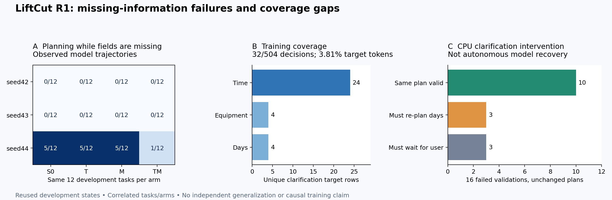

# R1 短板定位与 D2 的 CPU 实验

本轮在原42/43/44结果全部公布之后开展。旧分数、候选门槛、固定代表seed42均不改，
不读取48个保留任务，不调用模型或租用GPU。调查代码与可重算数据分别在
[审计脚本](../../research/liftcut-agent/analyze_agent_shortfalls.py)、
[完整审计](../../research/liftcut-agent/reports/agent-shortfalls-2026-10-02.json)。

## 1. 已定位到行为发生在哪一步

对三个seed四组共144条完整任务轨迹重新执行环境回放，并在每个动作前计算实际
缺失字段。这里的“跳过澄清开始规划”精确定义为：字段仍缺失时执行search_exercises、
validate_plan或propose_plan；同一条任务只计一次。

| seed | S0 /12 | T /12 | M /12 | TM /12 |
| --- | ---: | ---: | ---: | ---: |
| 42 | 0 | 0 | 0 | 0 |
| 43 | 0 | 0 | 0 | 0 |
| 44 | 5 | 5 | 5 | 1 |

seed44 的S0/T/M共同在缺时间、用户不回复时间、缺器械、缺日期、记忆加缺时间五例
出现这个行为；TM只在记忆加缺时间例出现。**0不表示任务全对**：42/43还有记忆
值选择、计划校验和终态错误。也不能只数wrong_action，因为真实不可行场景中的
错误动作、缺信息场景中的错误动作可能产生同名反馈。

## 2. 新运行的16次环境干预：原计划不改，只实际请求澄清

在上述16条失败轨迹的校验前复制真实环境状态，执行request_clarification，再由
原场景的ScriptedUser返回其本来允许的答复，然后用**原封不动的那份计划**再次
validate_plan。没有调用模型，没有给无答复场景编造答案，没有替换计划字段。

| 干预后的实际结果 | 数量 | 说明 |
| --- | ---: | --- |
| 原计划转为校验通过 | 10/16 | 这些时刻的失败可由缺失约束解释，不需要修改原计划才能使校验通过 |
| 得到答复，但原计划仍失败 | 3/16 | 都是缺日期；回复后暴露unavailable_day，必须按真实日期重规划 |
| 用户仍不回复，不能继续规划 | 3/16 | 原unanswered_time；应等待用户，不能将未知等同于无解 |

**10/16不是模型恢复率，也不是修复后的任务成功率。** 它只证明：在这10个具体
环境状态里，允许的澄清改变了校验结果。模型是否会主动提问、使用答案并完成后续
动作，仍未通过新推理验证。16例来自重复开发任务和相关的四组模型，不做独立统计
显著性结论。原失败分数保留。



图由[脚本](../../research/liftcut-agent/plot_agent_shortfalls.py)读取审计JSON生成；
左图是历史模型行为，右图是本次CPU环境干预，两者分开计量。

## 3. 训练里有示范，但分布窄且缺恢复状态

从原冻结准备清单校验SHA后读取四组各504条最终assistant监督目标及其真实分词。
四组目标分布相同，输入历史不同。两轮使用1008条、监督token共41,788；下表的
token使用量不是梯度贡献或损失权重，不能据此断言因果。

| 指标 | 每组实际覆盖 |
| --- | ---: |
| 澄清目标 | 32/504条；两轮64次 |
| 其中时间 / 器械 / 日期 | 24 / 4 / 4条 |
| 澄清监督token | 1,592 / 41,788，约3.81% |
| validate_plan与propose_plan监督token合计 | 26,144 / 41,788，约62.56% |
| wrong_action之后的监督决策 | 0条 |
| unknown_evidence之后的监督决策 | 0条 |
| session_count_mismatch之后的监督决策 | 0条 |

解释分三层：

1. **已观察到：** 某些训练seed会在未知约束下推进计划，并把业务校验失败结束为
   infeasible；模型调用成功、`ok=true`不能代表业务判断正确。
2. **有依据的假设：** 少量且固定的澄清示范，加上完全缺失的错误恢复状态，可能让
   策略在训练轨迹之外不稳定。它与“计划格式学会了，何时提问/重规划仍薄弱”一致。
3. **尚不能确定：** 这些分布差异是否直接导致回退，初始化与打乱顺序各贡献多少，
   增加哪些数据能改善。原seed同时改变初始化和顺序；相同监督分布下42/43没有同类
   跳步，不能把原因说成“模型没见过澄清”或“只要多训几轮就行”。

工程上可执行的研究问题是：**小模型能否区分缺信息、计划字段错误和真正无解，
并在正确状态下选择澄清、修复、等待或退出？** 这比增加模型规模更容易形成可解释
的证据链，但下一次干预仍须按原触发条件决定。

## 4. D2 已实现并运行的 CPU 部分

[构造/执行/评分器](../../research/liftcut-agent/counterfactual_diagnostics.py)与
[准备/分词核验](../../research/liftcut-agent/prepare_counterfactual_diagnostics.py)新增在独立文件中；
不修改冻结R1云端代码。[准备证据](../../research/liftcut-agent/reports/counterfactual-diagnostic-preparation-v2.json)
保存源文件、样本、真实前缀和分词的精确hash，并绑定原seed42四份adapter hash。

| 面板 | 每adapter例数 | 本次实际CPU验收 |
| --- | ---: | --- |
| 记忆 | 48 | 3位置×2干扰×2澄清×4值角色；30分钟约束保证四种器械均可行 |
| ID双射 | 12 | 只对第一个值映射组重命名记录/记忆ID；双射可逆，语义投影不变 |
| 授权 | 12 | 4状态×plain/context/memories；真实用户授权/撤销，不由模型自授权 |
| 可修复校验 | 4 | 两个原错误族各两个变体；失败反馈只含预定错误，参考实际修复并完成 |
| 真不可行 | 4 | 与修复例成对，仅改时间约束；最短合规组合仍超过预算，保留证明 |

80/80**脚本参考合约**通过环境执行和完整回放，不是模型80/80。参考响应中的固定
mock usage只用于预算接口回归；真实prompt长度由固定tokenizer另行重建。两份独立
准备产物逐字节相同。最长handoff及脚本参考请求均为2,295 token，预留512输出后
为2,807，小于4,096；不截断。模型实际后续请求仍需运行时context guard，不能用
参考轨迹长度保证任意模型轨迹都能容纳。

首响应面板不沿用旧“最多三次请求直到有效动作”口径：只生成一次，合法read batch
全部执行；只有get_context/get_memories时单列defer。批次一项正确、另一项错误时
不给成功。八个完整续接最多各八次请求。解析错、超时保留在面板分母；缺失/重复/
乱序记录拒绝作为完整报告发布。后续云端收集必须显式处理未执行条目，不能删掉。

纠错评分另外记录“目标字段是否已修复”和“完整任务是否完成”。修好证据ID后又犯
session_count错误，不计成证据ID未修复，避免错误触发G1。CPU回归包括批次丢弃、
未授权批次、伪修复、篡改响应/分数、身份置换、标签隔离及请求上限。

## 5. 下一步和开机条件

本轮完成**短板调查、16次环境干预和80例实验合约**。D2 GPU结果仍为零，GPU窗口
控制器、固定校准顺序/吞吐估计、部分结果归档、独立恢复/回执和关机链路仍待完成。
当前不应开服务器等待开发。没有新增算力或模型API费用。

下一增量补齐以上执行层并做断点/失败演练，通过最终精确提交CI后才通知开机。
仍按[已保存计划](2026-10-02-post-r1-next-plan.md)：固定seed42，四组320续接，最多
544次生成；预留¥5、工作90分钟、硬停止120分钟，按实际开机起算，参考¥2.18/小时，
不含存储。校准包含在正式320例内，时间不够就保存部分结果并停，不延长窗口。

本轮新发现不会把原G1的unknown_evidence/session_count_mismatch偷偷替换成澄清
训练。先完成D2；如果要单独研究主动澄清训练，应另立有对照、预算和门槛的实验。
不增加seed45，不使用保留任务选探针，不挑seed44 TM替换固定代表seed42。

## 6. 本地复现和学习检查

在仓库根目录、已经准备原state-coverage数据及固定tokenizer后执行：

```powershell
python research/liftcut-agent/analyze_agent_shortfalls.py --prepared-dir research/liftcut-agent/outputs/state-coverage-v1 --check
python research/liftcut-agent/prepare_counterfactual_diagnostics.py --tokenizer-dir research/liftcut-agent/outputs/tokenizers/cdbee75f17c01a7cc42f958dc650907174af0554 --output-dir research/liftcut-agent/outputs/d2-new-copy
python -m unittest discover -s research/liftcut-agent/tests -p test_counterfactual_diagnostics.py -v
python -m unittest discover -s research/liftcut-agent/tests -p test_agent_shortfalls.py -v
```

输出目录必须全新；用`--verify-only --output-dir ...`验证已有准备产物。CI使用固定
tokenizer依赖重建两份准备目录并比较，CPU测试不需要torch/GPU。

本地全量401项回归通过，随后新增的评分边界另行通过专项验证。首次Linux CI已
通过403项回归，但发现来源清单在Windows使用反斜杠、Linux使用斜杠，导致审计
报告比较失败；已统一为仓库相对POSIX路径并增加可移植性回归，不改变实验数字。
以[PR27](https://github.com/Townzc/liftcut-tracker/pull/27)最终精确提交的全部检查作为合并依据。

学习时手工跟两条：

- seed44 S0 memory_missing_time：找到正确dumbbell检索、max_minutes仍空、wrong_action；
  检查本轮仅补回复后同计划校验通过。解释为什么这仍不能声称模型会自主恢复。
- seed44 S0 missing_days：同样补入回复后，错误由wrong_action变成unavailable_day。
  解释为什么“问了就继续照旧计划执行”仍然不对，为什么需要重新规划。

面试应能区分：历史轨迹回放、环境反事实干预、脚本参考成功、真实模型推理、独立
保留集验证。当前新增证据覆盖前三项，不把它们混成一次模型性能提升。
