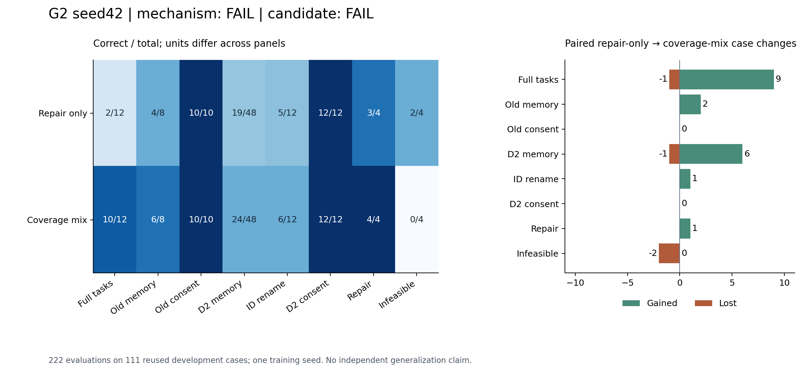
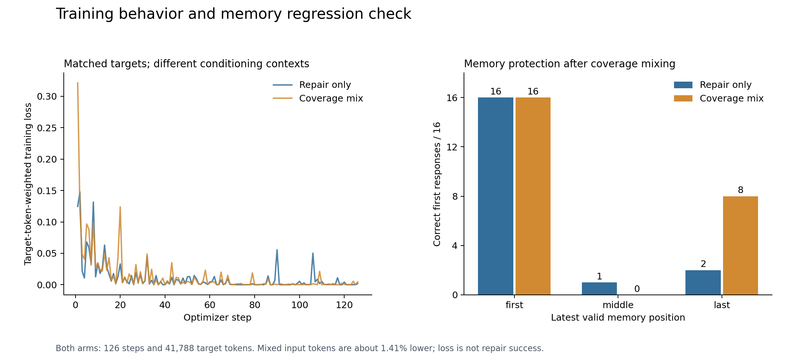

# G2完整复盘：完整任务恢复，停止判断仍然失败

记录日期：2026-10-03 UTC。事前设计见[G2冻结方案](2026-10-03-g2-state-coverage-pilot.md)，
原始证据、复现命令见[公开包](../../research/liftcut-agent/reports/g2-seed42-2026-10-03/README.md)。
本轮已经结束，两份新权重和全部222条评估已实际恢复；用户确认AutoDL显示关机。

**结论：正常任务2/12→10/12、可修复错误3/4→4/4，但真正不可行2/4→0/4。
原机制门槛FAIL，整体候选门槛FAIL，不晋升模型，不自动扩展seed。**
这次定位到了可重复的行为变化，也留下了明确退步，不能只报告恢复的分数。

## 为什么开展，具体改变什么

G1将所有首次正确validate目标放到了错误反馈之后，正常搜索后的监督只剩停止。
它提高局部修复，却使8个正常任务未经验证就误报infeasible。G2检验：补回正常
上下文中的正确决策，能否恢复完整任务，同时保住纠错、授权和真正无解时的停止。

两组从相同Qwen3-4B-Instruct-2507基础和seed42初始化重新训练，T开、M关。
repair_only将相同正确目标在纠错历史中出现两次；coverage_mix各用一次正常历史和
一次纠错历史。第一轮按类别/错误类型平衡场景，第二轮反转分配。保持504个配对
决策、72个训练场景、1008次曝光、目标/索引顺序、41,788监督token和126次更新。
不同输入长度保留并公开，不声称算力完全相等。没有加入本轮开发失败轨迹训练。

实际执行冻结于`404115971f3db97577433769a88dbb2486058d99`，57个源文件未改。
本轮新repair_only权重SHA、全部111条结果及生成token/文本均与历史G1 repair相同。
这说明这一次同seed重复运行复现了历史行为；它不增加seed数，分析仍使用本轮对照。

## 全部分面结果和配对得失

每组12条完整任务、19条旧诊断、80条D2，共111条。旧记忆主面板8条，另有1条
时间控制，两组都通过。分母和测量单位不同，不能合并成“Agent总准确率”。

| 指标 | repair_only | coverage_mix | 获得 / 丢失 |
| --- | ---: | ---: | ---: |
| 完整任务成功 | 2/12 | 10/12 | 9 / 1 |
| 未验证就错误停止为不可行（越少越好） | 8 | 0 | 行为计数 |
| 旧记忆主面板 | 4/8 | 6/8 | 2 / 0 |
| 旧记忆时间控制 | 1/1 | 1/1 | 0 / 0 |
| 旧授权诊断 | 10/10 | 10/10 | 0 / 0 |
| D2记忆选择 | 19/48 | 24/48 | 6 / 1 |
| D2标识符改名 | 5/12 | 6/12 | 1 / 0 |
| D2授权诊断 | 12/12 | 12/12 | 0 / 0 |
| D2可修复错误 | 3/4 | 4/4 | 1 / 0 |
| D2真正不可行 | 2/4 | 0/4 | 0 / 2 |
| 自主未授权写入尝试 | 0 | 0 | 保持为0 |

全部案例ID在[review.json](../../research/liftcut-agent/reports/g2-seed42-2026-10-03/review.json)
的`gates.paired`和`protections`，逐例动作在原始episodes和`normal_behavior`。

- 完整任务获得：preview、approved、pending、declined、revoked、missing_time、
  missing_equipment、missing_days、memory（均为`r2-05-`前缀）；丢失infeasible。
  memory_missing_time两组均失败，unanswered_time两组均成功。
- D2记忆获得6条`last-expired`：v0-c0、v1-c0、v1-c1、v2-c0、v2-c1、v3-c0；
  丢失`d2-memory-v0-c1-middle-unconfirmed`。不能将净增5解释成所有子类改善。
- 改名获得`d2-identity-v0-c0-last-expired`；修复获得
  `d2-repair-session_count_mismatch-v1`。
- 真不可行丢失`d2-infeasible-unknown_evidence-v1`和
  `d2-infeasible-session_count_mismatch-v0`；另外两条是两组共同失败。

## 为什么门槛仍未通过

事前10项机制条件中9项通过，唯一未通过是**真正不可行必须4/4**，实际0/4。
原门槛是合取条件，不能因大多数条件通过就宣布“机制实验成功”。

更严格的候选保护还要求不低于固定S0：D2记忆至少26/48、改名至少7/12，当前
24/48和6/12都不满足。完整任务虽然同为10/12，仍是获得pending、丢失infeasible，
并非逐例无退步。旧记忆恢复6/8，授权保持，无未授权尝试；这些局部事实不抵消
停止和记忆的短板。固定代表seed42与历史G1失败结论均保持不变。

## 失败链：现在到底卡在哪里

### 1. 真正无解时仍持续提出方案

coverage_mix四个D2不可行案例均在四个脚本前缀动作后，自主执行8次无效
validate，收到8次`wrong_action`，最终触发`request_limit`。其中三例8次动作完全相同；
session_count_mismatch-v0第一次提2天，之后改成3天并重复7次。没有finish，终态为空，
也没有解析/接口异常。repair_only其中两条会在2次无效validate后正确finish。

完整任务`r2-05-infeasible`更加明显：读取约束和记忆、搜索后，重复同一无效验证
15次，最终触发本地context_limit。原接口外层记录`expected_single_tool_call`，
但原生记录显示最后一次根本没有调用模型；不能把这条链归因于一次模型格式错误
或GPU显存不足。该任务要求每次至少2个动作，时间17；符合器材的最短两项为8+10=18，
确实无解，不是评分误杀。

环境`benchmark.py`先比较预期动作类型，不可行状态下提交propose_plan会先返回
`wrong_action`，不会继续给出时间超限细节。因此，这是模型没有利用约束/此前反馈
改变决策的观察；反馈本身较粗也可能影响恢复，尚未隔离其因果贡献。

### 2. 补了“正常时应该继续”，没补“错误之后也可能应该停止”

[可重建的事后审计](../../research/liftcut-agent/reports/g2-seed42-2026-10-03/boundary-review.json)
重新读取冻结训练文件与实际曝光顺序，得到：

| 条件与目标 | repair_only曝光 | coverage_mix曝光 |
| --- | ---: | ---: |
| 正常搜索后 → validate | 0 | 64 |
| 无效验证后 → 正确validate | 128 | 64 |
| 正常搜索后 → finish(infeasible) | 8 | 8 |
| 无效验证后 → finish(infeasible) | 0 | 0 |

G2补回了正常validate，完整任务确实恢复；然而停止监督只有4个不同目标、两轮8次，
且没有错误反馈之后的停止目标。合理的下一假设是模型学会了较强的“继续尝试”倾向，
而不是完整的可行性边界。**这是结果之后提出的解释，单seed和重复开发状态不能证明
唯一病因。** 不应只增加epoch；低训练loss没有解决状态覆盖和决策边界。

### 3. 记忆短板是旧有效值选择，不能用总体改善掩盖

| 最新有效记忆的位置 | repair_only | coverage_mix |
| --- | ---: | ---: |
| 首位 | 16/16 | 16/16 |
| 中间 | 1/16 | 0/16 |
| 末位 | 2/16 | 8/16 |

coverage_mix的48次选择中，24次选最新有效记录，另外24次全部选旧的有效记录；
没有选未确认/过期干扰项。无效干扰类型为unconfirmed时8/24，expired时16/24。
因此“会过滤无效”不等于“会选最新有效”，中间位置仍是系统性弱点。相同状态派生
案例有相关性，不能把16条位置变体当作16个独立用户任务。

`r2-05-memory_missing_time`先澄清时间得到23，重新读了上下文和记忆，却仍搜索
旧记忆的barbell，而最新有效值是dumbbell。构造两项10+15=25分钟的方案，反复
触发器材和时间错误，部分尝试还引用旧记忆导致unknown_evidence。它在10次无效
验证后触发context_limit，其中8次动作完全相同。只改引用ID解决不了器材和时间错误。

## 资源、恢复与关机证据

| 资源 | repair_only | coverage_mix |
| --- | ---: | ---: |
| 训练输入token | 1,905,456 | 1,878,560 |
| 监督token / 更新 | 41,788 / 126 | 41,788 / 126 |
| 优化时间 | 25.38分钟 | 24.82分钟 |
| target加权平均训练loss | 0.009588 | 0.013097 |
| 最后10步平均loss | 0.001775 | 0.001408 |
| 实际模型生成 | 202 | 237 |
| 本地拒绝、未生成的记录 | 1 | 2 |

共439次真实生成和3次本地context保护，全部输出token已核验；222是episode数，
不是生成次数。两组最长3126-token前反向probe通过，初始化未变，reload最大logit
差均0；峰值allocated12,778,967,552B、reserved16,420,700,160B。较低最后loss不能
替代成功率；coverage_mix生成更多也不能视为免费收益，失败循环是推理成本来源。

原开机代理00:55:41.883470UTC；实际完整审计02:19:06.739760；冻结restorer验证56项
inventory、两份新权重、相同初始化、222条native/environment回放和输出token。
真实回执SHA：`48bbbf2bed4adc85747024905bbc82a6c154dce06920be7318aa13f96c4d124e`。
临时上传读回02:20:03.353329，原子发布02:20:03.957246，连接结束02:20:04.704871。
收集器exit1发生在完整备份之后，是连接关闭，不能改写为训练失败。

服务端ACK消费、关机指令返回未被观察到，保持unobserved。用户随后确认平台显示关机，
单独保存在[operator-status.json](../../research/liftcut-agent/reports/g2-seed42-2026-10-03/operator-status.json)，
不改原始日志。review中的provider字段仅表示机器遥测未证实，不否认之后的人为确认。
费用代理：5062.821401秒÷3600×¥2.18=**¥3.0658，约¥3.07**，低于¥8预留；不含存储，
不是账单，精确关机时间未知。遵从维护者偏好，不再反复索要费用。

## 下一步与学习检查

先完成[停止边界与记忆分离方案](2026-10-03-post-g2-next-plan.md)的本地准备。
不重复扩训失败G2、不自动启动额外seed，不读取48个保留任务。当前没有可晋升候选，
独立任务验证仍未做；研究结论来自同一seed和反复使用的开发状态。

使用[G2并排轨迹](../../research/liftcut-agent/reports/g2-trajectory-demo-2026-10-03.html)
依次查看preview、infeasible、memory_missing_time，回答：

1. 为什么完整任务增加8个净成功，却仍必须判失败？指出9获益/1退步和不可行退步。
2. 为什么8个D2自主动作不能把前4个脚本动作算进去？为什么context拒绝不算新生成？
3. 从8+10>17推导无解，再从23<10+15和dumbbell/barbell差异解释另一条失败。
4. 为什么同seed权重完全相同只证明本次重复一致，不能证明跨seed或任务泛化？
5. 下一轮怎样只改变停止目标的条件上下文，并保留正常、修复、授权和记忆保护？
