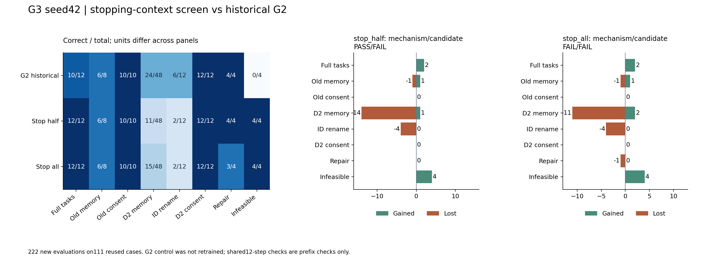
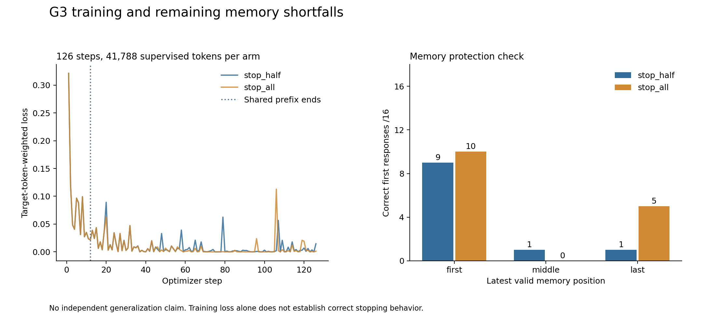

# G3完整复盘：半量停止覆盖有效，但记忆退步阻止整体晋升

记录：2026-10-03 UTC。两组新seed42权重、222条native/environment轨迹、376次
真实生成的token全部通过冻结恢复器核验。原执行提交为`eaa132538fefdf28973d808dd56a159e19b86d67`，
两组初始化相同、共享前12步一致。G2 coverage_mix是历史对照，**本轮没有完整重训它**。
公开原始证据和复现命令见[结果包](../../research/liftcut-agent/reports/g3-seed42-2026-10-03/README.md)。

## 为什么做、实际改了什么

G2保留clean/repair监督后，正常任务和修复恢复，但真不可行0/4，完整不可行任务
重复验证无效方案直到上下文保护。数据审计显示错误反馈之后只有继续验证，没有
正确停止目标。因此G3保持同一目标/索引/训练预算，只把既有不可行目标挪到真实
错误验证之后：half移动4次、all移动8次，错误动作不进入监督。

每组仍504个目标、1008次曝光、126步、41,788监督token。两组分别处理1,879,075/
1,879,590输入token，优化1470.15/1472.76秒，峰值分配约12.78GB，最长3126-token
前反向探针通过，权重重载logit差0。只能说监督预算匹配，输入预算并非完全相同。

## 原门槛判定

| 面板 | 历史G2 coverage_mix | stop_half | stop_all |
| --- | ---: | ---: | ---: |
| 完整任务 | 10/12 | 12/12 | 12/12 |
| 旧主记忆 | 6/8 | 6/8 | 6/8 |
| 旧授权 | 10/10 | 10/10 | 10/10 |
| D2记忆 | 24/48 | 11/48 | 15/48 |
| ID改名 | 6/12 | 2/12 | 2/12 |
| D2授权 | 12/12 | 12/12 | 12/12 |
| 修复 | 4/4 | 4/4 | 3/4 |
| 真不可行 | 0/4 | 4/4 | 4/4 |
| 全部111例误停 | 0 | 0 | 1 |
| 停止机制门槛 | G2历史失败 | **通过** | **失败** |
| 整体候选门槛 | 失败 | **失败** | **失败** |

两组均无自主未批准写入尝试。按事前规则只把stop_half配方带入后续研究，不晋升
整体adapter。all把一个可修复的session_count_mismatch任务误判无解，说明把所有
停止目标放到错误之后会损失边界；不是“停止样本越多越好”。不能事后放宽零误停要求。

## 逐例收益与回退

正常任务两组都新增通过`r2-05-infeasible`和`r2-05-memory_missing_time`，没有正常
任务丢失；四个D2不可行状态全部恢复。half保住四个修复任务；all丢失
`d2-repair-session_count_mismatch-v1`，实际模型动作是错误的`finish(infeasible)`。

旧记忆合计不变却不是同一批题：half新增`sd1-memory-0-last-unconfirmed`，丢失
`sd1-memory-1-last-expired`；all新增同一题，丢失`sd1-memory-0-first-unconfirmed`。
D2记忆half为1获得/14丢失，all为2获得/11丢失；两组ID各丢失4例、没有获得。

完整111案例中，历史G2正确73；half为62，8获得/19丢失；all为65，9获得/17丢失。
这包含门槛110例之外的一个诊断负对照。不同面板的案例不是可互换单位，合计仅
用于核对没有遗漏，不能拿正常12/12包装为全系统提升。全部案例、首次分歧动作和
policy failure均保存在`review.json → arms → all_case_comparisons`。

## 短板原因：哪些已有证据，哪些还只是解释

停止方面，half同时保住修复并恢复不可行，与“错误之后缺少停止监督”的解释一致。
all的反例说明还必须保留clean停止条件，单一条件替代会使某些可修复错误被过度终止。
这是固定seed上的机制证据，仍不能外推到全部错误类型或长程任务。

记忆方面，G3的退步比G2更广：half首/中/末分别9/16、1/16、1/16，all为10/16、
0/16、5/16。half的48个选择中21次选旧有效值、15次选无效干扰项、1次用原输入值；
all为19次旧值、14次无效项。G2曾只错选旧值，因此不能继续把G3全部错误解释为
“选第一条有效记录”。现在连有效性过滤也不稳，ID改名2/12进一步提示策略依赖表面模式。

仅改变4/8个曝光也引起非目标能力波动，表明小数据SFT的决策边界脆弱；尚不能
区分全部参数干扰、模板/ID依赖和分布外组合的贡献。低loss不证明学会了revision规则。
训练排列缺口仍是明确可操作的因素，但不是已证实的唯一根因。下一轮用完整新对照
和仅排列干预检验它，防止把一次固定seed波动当稳定改善。

## 归档、故障与成本

实际计算结束06:50:07.194051 UTC；完整恢复结束后，07:13:23原子发布真实回执，
07:13:24独立通宵交接流程验证了相同回执，58个原始文件核验通过。每组实际权重
132,187,888字节、504个tensor；公开包省略且只省略这两份权重，保留SHA和恢复证明。

原本地收集会话中途丢失，确切时间和原因未知，06:30进程检查确认旧进程不存在。
保留旧部分文件，在新目录核对101,777,408字节远端前缀后复制续传，没有重复训练。
新交接观察器又曾把原电源守护误认成训练子进程，保留失败并修复精确身份分类，
06:58:51完成交接；实际训练条件和74个源文件没有变化。

用户随后明确授权持续使用到洛杉矶07:00 / UTC14:00、累计预留¥20。
因此本轮结束后**服务器仍保持开机**，独立14:00守护已启动；原控制器没有消费回执
的观察证据，新交接流程的真实消费另记。没有宣称已关机或停止计费。

从本次05:35:00.409447开机到07:13:24收集结束，累计时间代理98.39分钟、约¥3.575；
此前首次失败另约¥0.363，合计至此约¥3.938。这个数包含等待/下载且尚非整夜最终费用，
不能与未来窗口再重复相加。若持续至14:00，含首次失败上限代理约¥18.711，不含存储。

## 下一步与学习检查

下一轮固定half停止配方，重新训练完整对照，单独改变32个训练记忆场景的排列，
覆盖12种位置×干扰类型组合。先验证所有记录/标签/目标token/非记忆上下文不变，
再冻结门槛、执行代码和连续租期；仍保留48题不使用。若记忆改进伴随停止或授权退步，
不晋升、不自动加seed。后续系统记忆解析对照与模型学习贡献分别报告。

维护者应能解释：为什么half机制通过却全111例合计下降；为什么all误停是重要反例；
如何从真实调用区分旧值选择与无效项选择；以及为什么前12步一致不等于完整对照重训。
