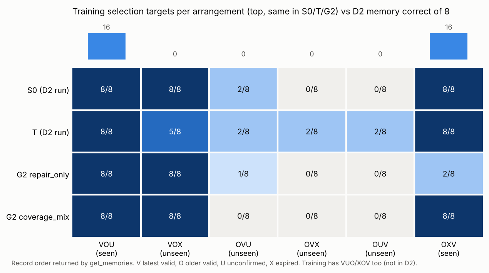

# 记忆选择审计：训练里只出现过4种记录排列

记录日期：2026-10-03 UTC。对应[G2之后方案](2026-10-03-post-g2-next-plan.md)的“本地阶段B”：
先统计训练数据实际覆盖了哪些记忆组合，再决定怎么改。只读已有训练池与已发布评估，
**没有新训练、推理或评分规则改变**；结论是事后描述，不是因果证明。

## 1. 做了什么

`get_memories`每次返回3条equipment记录：最新有效值V、较旧有效值O、一个干扰项
（未确认U或已过期X）。把每次返回按顺序写成字母串，例如`OVU`表示“旧有效、最新有效、
未确认”。[analyze_memory_coverage.py](../../research/liftcut-agent/analyze_memory_coverage.py)
对G2实际1008次曝光逐条统计，再按同一方式拆分D2的48个记忆案例（每种排列8例）。
原始结果见[audit.json](../../research/liftcut-agent/reports/memory-coverage-2026-10-03/audit.json)。

## 2. 观察

| 排列 | 训练中选择器材的目标 | S0（D2） | T（D2） | G2 repair_only | G2 coverage_mix | coverage_mix错误时选了 |
| --- | ---: | ---: | ---: | ---: | ---: | --- |
| VOU | 16 | 8/8 | 8/8 | 8/8 | 8/8 | — |
| VUO | 16 | 不在D2 | | | | |
| XOV | 16 | 不在D2 | | | | |
| OXV | 16 | 8/8 | 8/8 | 2/8 | 8/8 | — |
| VOX | 0 | 8/8 | 5/8 | 8/8 | 8/8 | — |
| OVU | 0 | 2/8 | 2/8 | 1/8 | 0/8 | 8次都选O |
| OVX | 0 | 0/8 | 2/8 | 0/8 | 0/8 | 8次都选O |
| OUV | 0 | 0/8 | 2/8 | 0/8 | 0/8 | 8次都选O |

1. 训练数据只有4种排列：V在第一位时干扰项总是U，V在最后一位时干扰项总是X。
   **V从未出现在中间；“O在V前面且干扰项是U”也从未出现。** S0/T/G2训练用的是同一套
   排列生成代码（M/TM组另有翻转），所以这是长期存在的数据缺口，不是G2引入的退步。
2. coverage_mix的24个错误全部集中在训练没见过且O排在V前面的三种排列，并且全部选O；
   没有一次选干扰项。它的行为可以完整地用“选第一条有效记录；只在见过的OXV模式里选
   最后一条”解释。
3. 若模型真的比较revision，排列不应影响结果。这里排列几乎决定了对错，说明模型学到的
   更像位置模板，而不是“最高revision的有效记录”这一规则。

这与G2复盘中的“中间0/16”一致，但给出了更具体的形状：问题不只是中间位置，而是
“旧有效值排在前面”这一组合在训练里只和X一起出现过。

## 3. 解释的边界

- 这是对已有结果的事后归纳。相同模板派生的D2案例彼此相关，48例不是48个独立任务。
- “位置模板”是与数据一致的最简解释，不是唯一解释；验证需要改变训练覆盖后再看。
- 训练池同时满足“选第一条有效记录”和“选最后一条有效记录”在部分排列上都成立，
  正是因为排列与干扰类型被绑定，模型才没有被迫学习revision比较。

## 4. 下一步候选（尚未冻结，不开机）

两条路线回答不同问题，结果必须分开报告：

- **A. 训练覆盖（模型能力）：** 在不增加曝光数的前提下，把16个记忆训练场景的排列改为
  覆盖全部12种（6种顺序×U/X），让位置与干扰类型都不再预测答案；评估仍用原D2
  48例，加上中间位置单独统计。前提是G3停止配方已固定，避免两个干预叠加。
- **B. 确定性记忆视图（系统设计）：** 工具直接返回“每个字段当前生效的值与来源ID”，
  模型只负责引用。这对产品端最稳妥，网站Agent也应采用；但它是系统模块的贡献，
  不能写成“模型学会了记忆选择”。

触发条件：G3结果公布后，按其决策规则确定停止配方，再冻结A的数据设计并预注册门槛。

## 学习检查

1. 从表格说明为什么coverage_mix在VOX上8/8，却在OVX上0/8，尽管两者训练中都是0次。
2. 用“选第一条有效记录”这一规则逐个预测6种排列的选择，与实际结果比较。
3. 为什么路线B在产品上更可靠，却不能作为路线A的研究结论？
