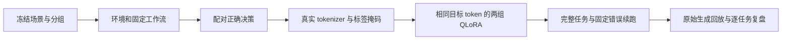

# 如何读懂这套 Agent 后训练实验

这项实验研究的是：工具调用模型出错后，加入“错误上下文 → 正确下一步”的监督数据，
能否改善后续决策，同时保留正常任务能力。LiftCut 的计划调整任务提供可执行约束、
用户确认状态和最终评分；当前数据均为人工编写的合成场景。

## 从场景到实验结果

| 环节 | 要看什么 | 对应入口 |
| --- | --- | --- |
| 场景 | 输入约束、记忆、后续用户事件、预期终态如何分离 | `controlled_recovery.py`、`benchmark/recovery-v2/` |
| 环境 | 工具的状态变更、错误码、审批与写入规则 | `src/liftcut_agent/environment.py` |
| 轨迹 | 每一步动作、工具观察和用户事件能否原样回放 | `src/liftcut_agent/workflow.py` |
| 决策数据 | 当前输入历史和正确的下一条 assistant 工具调用 | `src/liftcut_agent/trajectories.py` |
| 分词 | Qwen 原生模板下哪些 token 参与 loss | `tokenize_decisions.py` |
| 配对 | 两组顺序、目标 token、更新次数是否完全相同 | `prepare_controlled.py` |
| 训练 | 量化、LoRA、loss 加权、梯度、保存与重载 | `gpu_train_recovery.py --study v2` |
| 评测 | 模型自行调用工具，直至终止或失败 | `gpu_controlled.py`、`controlled_rollout.py` |
| 复盘 | 原始文本与动作是否一致，错误发生在哪一步 | `audit_controlled.py`、`review_controlled.py` |

这些文件位于 [research/liftcut-agent](../../research/liftcut-agent/)。运行命令与参数以
[执行方案](2026-09-29-controlled-recovery-experiment.md)及
[最新进度](../AGENT_RESEARCH_PROGRESS.md)为准。

## 一个训练样本究竟是什么

以“时长未知，却先提交了计划”为例，错误版本的上下文包含：用户已知条件 → 工具读取 →
错误的计划验证 → 环境说明信息缺失。监督目标是正确的 `request_clarification` 调用。
错误动作保留在历史中，但其 token 不作为这条样本的正向监督目标。

一个样本只监督最后一条正确 assistant 决策，用户文本、工具返回、历史 assistant
消息都设置为 `-100`。语言模型内部按自回归方式预测目标 token；tokenizer 审计必须
验证前缀稳定、目标完整、没有静默截断。仅打印一个平均 loss，无法证明掩码正确。

这里做的是离线监督微调。环境给出的成功/失败用于构造与审计数据，并没有作为
在线策略梯度奖励。因此不能把这套训练称作 Agent RL。

## 为什么要做配对对照

普通 SFT 与混合恢复 SFT 使用相同模型、LoRA 设置、seed、采样位置、正确目标和更新
次数。每次更新的目标 token 数也相同，loss 按该组目标 token 总数加权。
混合组只让部分目标前出现错误历史。这样可以把主要差异定位到训练上下文。

这不代表全部成本相同：带错误的历史更长，需要额外输入 token 和计算时间。文档必须
同时报告两组真实输入 token、训练时间和显存，不把“目标 token 相同”写成“算力相同”。
和旧版实验相比，数据覆盖及训练量都变了，跨版本分数差异不能全部归因于某一个修改。

## 两个评测面板回答不同问题

正常面板从初始状态开始，测完整任务能力。恢复面板先用公开、固定的脚本重建同一
错误状态，再交给模型继续运行；三组模型看到的错误前缀完全一样。

固定前缀的动作、用量和错误不能归功或归咎于续跑模型。完整轨迹仍需回放，以验证
审批、撤销、步数和工具状态。报告正常成功率、恢复成功率及自主错误时，要说明各自
分母和统计边界，不能把两种面板合成一个更好看的成功率。

“第一步可接受”只是诊断指标，例如重新读取上下文可能合理，但模型仍可能随后失败。
任务最终成功是主要指标。少调用几次工具、减少异常、loss 更低，都不自动等价于
恢复能力增强。

## 读结果时应追问什么

1. **有没有标签泄漏？** 模型可见的 ID、前缀和工具响应是否暗示了未来用户决定？
   旧版 category-bearing ID 的问题已经保留为负面案例，而非继续使用旧高分。
2. **提升发生在哪些相同任务上？** 看 C-only、R-only、双方成功、双方失败，不能只看
   两个平均值。样例的反事实版本不构成独立用户样本。
3. **失败是否进入了分母？** 格式错误、截断、上下文限制和步数耗尽都应保留。
4. **模型是否真正获取了缺失信息？** 先规划后提问，不能算“规划前完成澄清”。
5. **结论可以推广多远？** 当前只有一个训练 seed、一个开发 bundle、同一作者和
   同一模拟器。即使内部对照改善，也要经过重复 seed、固定候选的保留测试与独立
   来源任务，才有更强的迁移证据。

每轮先写假设、对照、停止条件和预算，再冻结代码和数据。失败结果也要保存原始
轨迹、解释根因，并据此缩小下一轮问题；不能为了产生正结果而不断改写成功标准。

## 新增练习：固定状态诊断

阅读 `state_diagnostics.py`，用 CPU 生成 19 个前缀，然后选一个 pending 状态和一个
记忆加澄清状态，沿着 `cases.jsonl` 的真实工具返回手工判断下一步。

先解释三个区别：脚本参考决策通过不等于模型通过；首个搜索正确不等于整个任务
成功；选择的值等于某条记忆不等于已经证明模型内部使用了该记忆。然后修改一份
本地副本：撤销有效记忆的确认、改变过期边界、或者在等待状态尝试 apply，预测
环境和评分如何变化，再用测试验证。不要修改已冻结的实验数据。

进一步看 `run_case` 为什么要执行完整个只读 batch 再停止、为什么脚本与真实模型
使用不同的预算边界，以及 `replay` 如何从原始响应重算决定。能独立说明这些选择，
比背诵一张最终成功率表更能体现对实验的理解。

## 从三条真实诊断开始读

本节在 38 条真实诊断完成并恢复后加入；[实验日志](EXPERIMENT_LOG.md) 是以后每轮
复盘的入口，[完整结果](2026-09-29-state-diagnostic-results.md) 提供所有案例。

**例一：已经拒绝，为什么又搜索？** 用户在合法 proposal 后明确 decline。直接
接手时 C/R 都 finish declined；同一个业务状态多读一次 get_context 后，两组都
get_memories→search_exercises。额外读取没有撤回用户的拒绝，所以首个有任务含义
的搜索不符合当前状态。这里的合理解释是状态整合不足，不能把流程重新开始当成
对拒绝的正确处理，也不能断言它继续多步之后绝对无法恢复。
[C 原始轨迹，第 4–5 行](../../research/liftcut-agent/reports/qwen-state-diagnostics-2026-09-29/evaluation/clean/episodes.jsonl#L4)

**例二：恢复之后答对，意味着掌握规则了吗？** pending 的正确终态是 awaiting_user。
R 在普通历史下回答 previewed，在被拦截写入之后才回答 awaiting_user；C 后者回答
infeasible。一个错误线索能帮助 R，并不意味着它已经稳定掌握“尚未批准”的含义。
这就是为什么需要相同状态下的配对历史，而不能只展示成功的一条恢复轨迹。
[R 原始轨迹，第 1–3 行](../../research/liftcut-agent/reports/qwen-state-diagnostics-2026-09-29/evaluation/mixed/episodes.jsonl#L1)

**例三：什么叫器械来源可区分？** 原始资料 bodyweight，旧确认 barbell，当前有效
确认 dumbbell，高 revision 但未确认/过期的记录 machine。正确规则是先检查确认
与时效，再在有效记录里比较 revision，最后应用用户明确更正。R 在带澄清、有效
记忆位于首位时搜索 machine；这是一次合法调用，但决策错误。检查 JSON 格式或
引用 ID 都不能替代约束语义检查。值匹配只能定位候选来源，不能读取模型内部原因。
[R 原始轨迹，第 15–16 行](../../research/liftcut-agent/reports/qwen-state-diagnostics-2026-09-29/evaluation/mixed/episodes.jsonl#L15)

读完后尝试用自己的话讲三分钟：前一轮的问题是什么，本轮控制了什么变量，发现
了什么行为，证据不能说明什么，下一轮怎样区分解释。再运行 CPU publication check，
观察篡改一个原始响应时为什么不能通过回放。练习请使用输出目录中的副本。

## 四组状态覆盖实验：读懂一个配对目标

新研究的训练输入见 `state_coverage.py`，采样与 token 配对见
`prepare_state_coverage.py`；[执行规格](2026-09-29-state-coverage-experiment.md)
列出了准确参数。这一增量只有 CPU 验证，模型训练结果尚未产生。

以 pending 为例，S0 的最后历史是有效预览，目标是 finish awaiting_user。T 在同一
用户状态下真实读取 context 或 memories，再监督完全相同的 finish awaiting_user。
被插入的读取不另导出成正目标，因此 T 没有多一次训练决策。输入更长，但最终
assistant 的 target token 完全相同；每次优化更新按相同监督 token 数归一化。

M 的关键是相同记录换顺序后，正确器械、证据 ID 和 proposal ID 都必须一致。
如果只改排列，却因为 episode identity 的计算顺序改变了 apply 参数，那就同时
改了训练目标。新研究排序公开事实生成 identity，测试会改变未来批准或澄清答案，
验证这些隐藏变量不会改变身份。

可以先手工挑 `sc1-01-pending`，比较四组 decisions 中最后的 assistant，再比较
其前面的工具返回。随后找同一个 memory 场景，对照 S0/M 的记录顺序与目标。
思考：为什么 72 个场景仍只来自四个 bundle，为什么 504 条导出决策在两轮训练
中变成 1,008 次使用，为什么按累积8得到126次更新？能解释这些数，才能说明
控制了什么，而不仅是背诵 LoRA 参数。

## 从 loss 与成本读懂训练循环

`gpu_train_state_coverage.py` 的微批量为 1，累积 8 条决策后更新一次。第 i 条决策
有 n_i 个监督 token，其模型 loss 是这些 token 的均值 L_i。这一次更新优化的是
`sum(n_i * L_i) / sum(n_i)`，因此每个反向传播乘 `n_i / sum(n_i)`。如果简单把八条
loss 各除以 8，会让短目标与长目标拥有相同总权重，这与“按目标 token 平均”的
实验约定不同。当前四组每一步的目标 token 完全相同，梯度权重也配对。

读训练日志时分清四个数：`step` 是优化次数，`decisions` 是累积使用的样本数，
`supervised_tokens` 是实际参与 loss 的累积 token，`input_tokens` 还包括被掩码的
上下文。第二轮再次使用同一条决策，所以使用次数会增加，独立训练样本并不会增加。

不同步骤遇到的目标不同，单条 loss 的波动不能直接代表训练变坏。分析工具按每步
新增监督 token 对一个 epoch 的 loss 加权汇总，同时保留所有原始点；不能挑最后
一条很低的 loss 当作总体性能。teacher forcing 看到的是正确历史，而闭环 Agent
可能走到自己的错误历史，所以低 loss 仍需完整任务及固定状态评测来检验。

显存也有两个口径：allocated 是张量实际占用，reserved 是框架向 GPU 保留的缓存。
最长样本探针检查的是能否完成该样本前向与反向，它没有执行 optimizer step，不
能算作多训练一次。最终 adapter 必须保存、重载并比较 logits，才能确认保存的是
当前可用模型；这仍不代表跨机器逐位相同或具备精确断点续训。

原始报告字段 `training_seconds_including_checkpoints` 的名字与计时边界不完全
一致：代码在训练循环之后、保存之前停止计时。新分析按真实含义标为“优化循环
耗时”，保留原字段。租机成本从容器启动代理计到关机观察，另包含准备、加载、
评测与备份；不能直接用优化循环时间乘单价当最终账单。

自检：把两条目标长度分别设为 10 和 90、loss 分别为 1 和 3，按 token 加权应为
2.8，按样本平均则为 2。然后在训练日志里手算一组新增监督 token，核对代码。
最后解释为什么模型用更多输入 token，却可以保持相同的监督量和更新次数。
