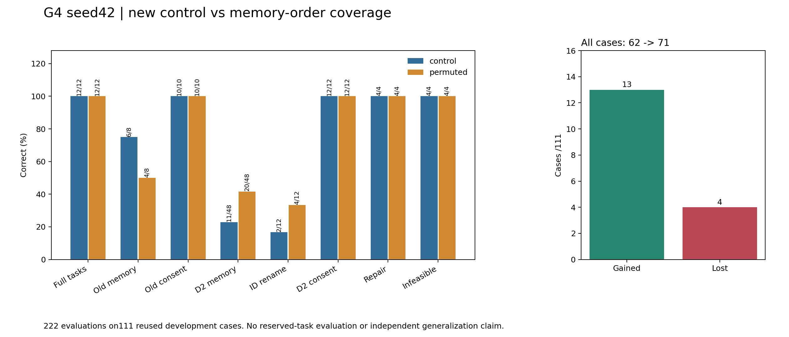
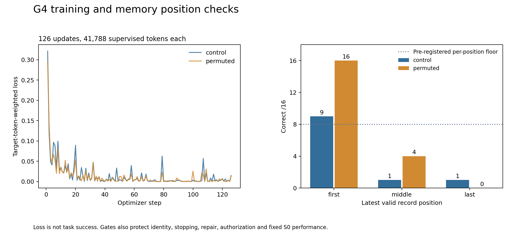

# G4 seed42：真实新配对训练结果

记忆11/48→20/48，旧记忆6/8→4/8；原机制与整体候选FAIL。正常12/12、授权、修复/不可行4/4、零误停保留。
222条实际native/environment回放、378次生成和两份真实权重已在本机核验；公开包省略权重。
48保留任务未用，无独立泛化主张。历史G3完整复现单列，不替代本轮control。

- [完整中文复盘](../../../../docs/research/2026-10-03-g4-complete-results.md)
- [全部111例与首处分歧](paired-cases.md)
- [机器分析](review.json)、[原始发布文件SHA](publication.json)、[真实恢复回执](restore-receipt.json)
- [原始本地事件](operations.jsonl)、[服务端ACK](backup-copy-status.json)

服务端仍按原14:00UTC租期运行；回执消费不是关闭或停止计费。窗口代理¥2.9610与累计¥9.6670重叠，不相加。
重建命令见analyze_g4_results.py及CI；CPU公开重建不能声称重新读取私有权重。图表已渲染核查。
