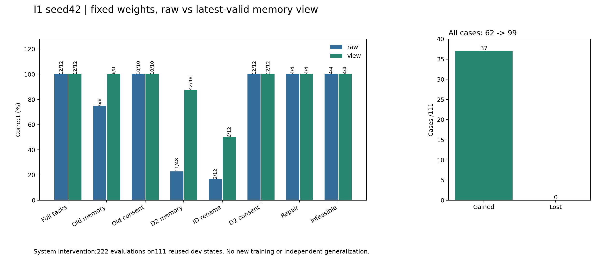
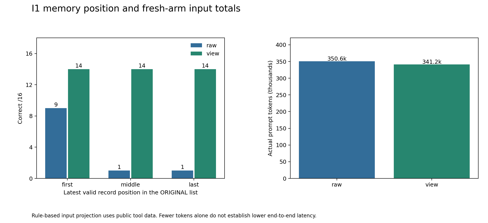

# I1 seed42: fixed weights, fresh raw/view inference

Actual run `i1-20261003-104045`, frozen execution `2bf816a02e116a3d26961bba817c49c590ccb910`.
Fixed preselected G4 control checkpoint, **no new training**. 222 evaluations on
111 reused development states, not111 independent full user tasks.48reserved tasks untouched.

- All states:62→99/111,37gains and0losses vs fresh raw.
- Memory:11→42/48; old memory6→8/8; ID rename2→6/12.
- Normal12/12, repair/infeasible4/4 each, consent retained;0false stops/unapproved attempts.
- **Mechanism FAIL**:ID6<10. FixedS0 ID7→6, so **candidate FAIL**. No promotion.
- New raw exactly reproduces historical G4 control native requests/outputs; it was actually rerun.
- Rule-based filtering is a system intervention, not learned selection or independent generalization.

[Complete review](../../../../docs/research/2026-10-03-i1-complete-results.md),
[all111 paired cases](paired-cases.md), [machine review](review.json),
[12 remaining failures and12 ID pairs](failure-localization.json), [next plan](../../../../docs/research/2026-10-03-post-i1-plan.md).




`publication.json` inventories the exact public originals; only the actual132,187,888-byte
control weight is omitted. Frozen restorer verified its actual bytes/structure,222 original
environment/native/projected-input episodes and378 generations/tokens before generating
the genuine receipt.55original files restored. [Receipt](restore-receipt.json),
[local events](operations.jsonl), [server events](server-events.jsonl) record separate
upload/atomic publication/server-consumption at11:04:40UTC. They do not assert power-off.

Actual input350,550→341,220 tokens (−2.66%); both189generations. Window compute proxy¥0.8408;
cumulative since original boot including prior failed opening¥12.3441. These overlap,
must not be added, and are not final provider charges.14:00UTC original power guard retained.

Rebuild public evidence with a prepared diagnostic/D2/tokenizer directory:

```text
python research/liftcut-agent/analyze_i1_results.py --public-dir research/liftcut-agent/reports/i1-seed42-2026-10-03 --diagnostic-dir DIAGNOSTIC --d2-dir D2 --tokenizer-dir TOKENIZER --check
python research/liftcut-agent/analyze_i1_failures.py --public-dir research/liftcut-agent/reports/i1-seed42-2026-10-03 --check
```

Public replay explicitly does not reload omitted weights or make new model calls.
